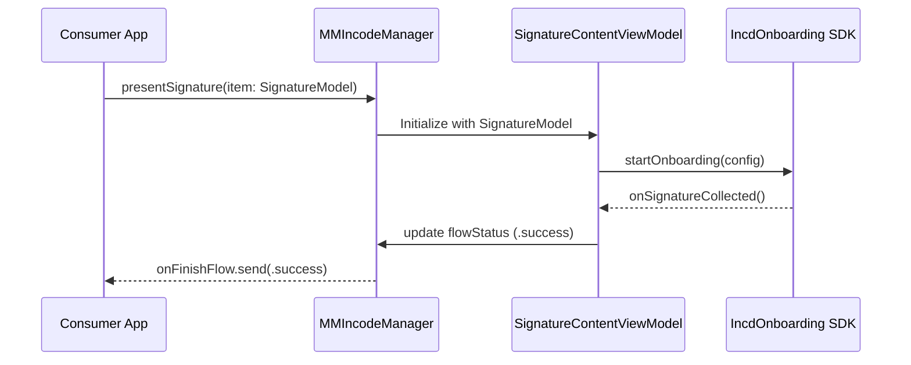

# Core Architecture

# Core Architecture

<details>
<summary>Relevant source files</summary>

The following files were used as context for generating this wiki page:

- [Package.swift](Package.swift)
- [README.md](README.md)

</details>


The `MMIncodeFacade` library implements a facade pattern to simplify the integration of the Incode Onboarding SDK into iOS applications. It abstracts the complexity of the underlying `IncdOnboarding.xcframework` binary, providing a streamlined SwiftUI-compatible interface and a reactive event model based on the Combine framework.

### The Facade Pattern

The architecture is designed to decouple the consumer application from the direct APIs of the Incode SDK. Instead of managing complex SDK initialization and delegate protocols manually, developers interact with a single entry point: the `MMIncodeManager`.

#### Dependency Chain
The system operates through a hierarchical dependency chain where each layer narrows the scope of responsibility:
1.  **Consumer App**: Configures `IncodeParams` and observes `onFinishFlow`.
2.  **MMIncodeManager**: Orchestrates the lifecycle, theming, and view presentation.
3.  **SignatureContentView / ViewModel**: Manages the UI state and conforms to the `IncdOnboardingDelegate`.
4.  **IncdOnboarding SDK**: The binary framework that performs the actual biometric and signature capture.

For details on the primary orchestrator, see [MMIncodeManager](#2.1).

### System Entity Mapping

The following diagram bridges the natural language concepts of the onboarding process to the specific code entities defined in the package.

**Diagram: Entity Mapping**
```mermaid
graph TD
    subgraph "Consumer Space"
        ["Consumer ViewModel"] -- "provides" --> [IncodeParams]
        ["Consumer View"] -- "calls" --> [presentSignature]
    end

    subgraph "Facade Space (MMIncodeFacade)"
        [MMIncodeManager] -- "initializes" --> [IncdOnboardingManager]
        [MMIncodeManager] -- "emits" --> [onFinishFlow]
        [SignatureContentViewModel] -- "implements" --> [IncdOnboardingDelegate]
    end

    subgraph "SDK Space (IncdOnboarding)"
        [IncdOnboardingManager] -- "renders" --> ["SDK UI Modules"]
        [IncdOnboardingDelegate] -- "notifies" --> [onSignatureCollected]
    end

    [IncodeParams] --> [Sources/MMIncodeFacade/MMIncodeManager.swift:10-14]()
    [MMIncodeManager] --> [Sources/MMIncodeFacade/MMIncodeManager.swift:16-18]()
    [onFinishFlow] --> [Sources/MMIncodeFacade/MMIncodeManager.swift:20-20]()
    [presentSignature] --> [Sources/MMIncodeFacade/MMIncodeManager.swift:42-42]()
```
**Sources**: [Sources/MMIncodeFacade/MMIncodeManager.swift:10-42](), [README.md:21-30]()

### Event Model and Data Flow

The architecture utilizes a reactive data flow. The consumer application does not poll for status; instead, it subscribes to a `PassthroughSubject` that emits a `FlowStatus` enum. This ensures that the application state remains synchronized with the SDK's internal state, whether the user completes the flow, cancels it, or encounters an error.

**Diagram: Signature Flow Logic**

**Sources**: [Sources/MMIncodeFacade/MMIncodeManager.swift:20-20](), [README.md:37-52]()

### Component Overview

The architecture is divided into three primary functional areas:

| Component | Responsibility | Reference |
| :--- | :--- | :--- |
| **Orchestration** | Managing SDK bootstrapping and the public API surface via `MMIncodeManager`. | [MMIncodeManager](#2.1) |
| **Data Modeling** | Defining the structures for configuration (`IncodeParams`) and content (`SignatureModel`). | [Data Models](#2.2) |
| **Theming** | Mapping brand-specific colors and fonts to the Incode SDK's configuration. | [Theming System](#2.3) |

### Binary Integration
The architecture relies on a `binaryTarget` defined in the Swift Package Manager configuration. The `MMIncodeFacade` target explicitly depends on the `IncdOnboarding` target, which points to the local XCFramework.

**Sources**: [Package.swift:23-30]()

---
**Next Steps:**
- To understand how to initialize the manager, see [MMIncodeManager](#2.1).
- To view the required data structures, see [Data Models](#2.2).
- To customize the UI appearance, see [Theming System](#2.3).

---