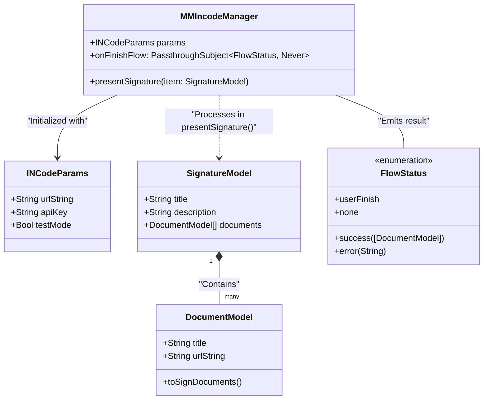
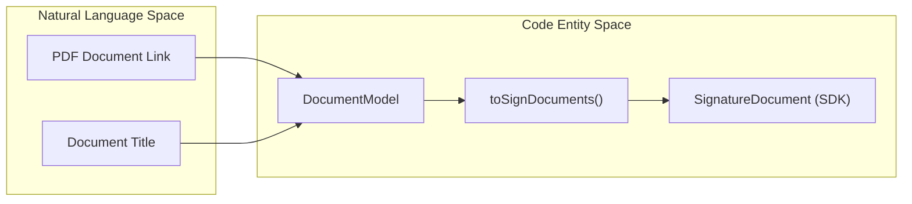
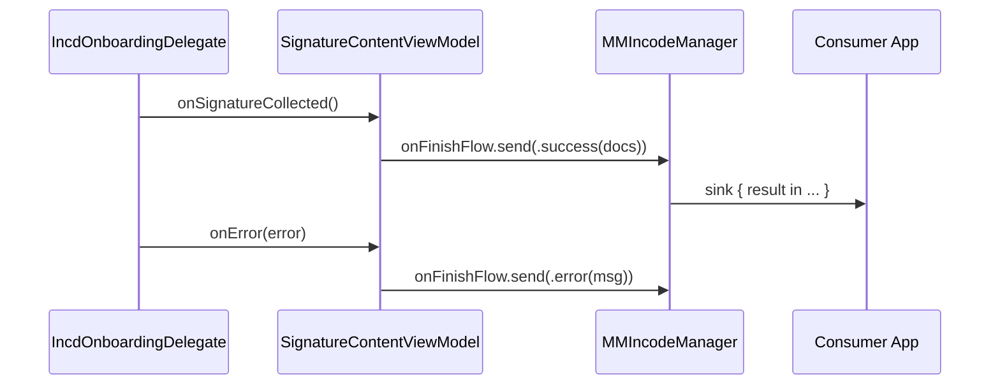

# Data Models

# Data Models

Relevant source files

The following files were used as context for generating this wiki page:

- [README.md](README.md)

This section provides a detailed reference for the public data structures used to configure and interact with the `MMIncodeFacade`. These models serve as the bridge between the consumer application's domain logic and the internal requirements of the Incode SDK.

## Overview of Data Structures

The facade utilizes four primary data entities to manage the signature flow:
1. **`INCodeParams`**: Configuration for SDK initialization and environment settings.
2. **`SignatureModel`**: The high-level container for a signature session, including metadata and documents.
3. **`DocumentModel`**: Representation of individual PDF documents to be signed.
4. **`FlowStatus`**: An enumeration representing the terminal states of a signature workflow.

### Entity Relationship Diagram

The following diagram illustrates how these models associate with code entities within the `MMIncodeFacade` and the `IncdOnboarding` SDK.

**Model Associations**

**Sources:** [Sources/MMIncodeFacade/MMIncodeManager.swift:14-30](), [Sources/MMIncodeFacade/Models/SignatureModel.swift:10-33](), [Sources/MMIncodeFacade/Models/FlowStatus.swift:10-15]()

---

## INCodeParams

`INCodeParams` is the configuration object required to initialize the `MMIncodeManager`. It encapsulates the credentials and environment flags needed by the underlying `IncdOnboardingManager`.

| Property | Type | Description |
| :--- | :--- | :--- |
| `urlString` | `String` | The base URL for the Incode API environment. |
| `apiKey` | `String` | The unique identifier for the client application. |
| `testMode` | `Bool` | When `true`, enables the SDK to run on simulators by bypassing hardware camera requirements. |

**Sources:** [Sources/MMIncodeFacade/Models/SignatureModel.swift:29-33]()

---

## SignatureModel

The `SignatureModel` defines the content and metadata for a specific signature session. It is passed to the `presentSignature(item:)` method of the manager.

| Property | Type | Default Value | Description |
| :--- | :--- | :--- | :--- |
| `title` | `String` | `"Autoriza tu cuenta"` | The title displayed in the signature preview screen. |
| `description` | `String` | `"Lee y firma el documento..."` | Instructional text for the user. |
| `documents` | `[DocumentModel]` | (Required) | A collection of documents that must be reviewed and signed. |

**Sources:** [Sources/MMIncodeFacade/Models/SignatureModel.swift:20-27]()

---

## DocumentModel

`DocumentModel` represents a single document within the workflow. It includes logic to transform the facade's model into the SDK's internal format.

### Key Function: `toSignDocuments()`
This method converts the `DocumentModel` into a `[SignatureDocument]` array, which is the type expected by the `IncdOnboarding` framework's signature module.

**Sources:** [Sources/MMIncodeFacade/Models/SignatureModel.swift:10-18]()

---

## FlowStatus Result Enum

The `FlowStatus` enum is used by `MMIncodeManager` to communicate the outcome of the signature process back to the consumer application via the `onFinishFlow` publisher.

| Case | Associated Value | Meaning |
| :--- | :--- | :--- |
| `.success` | `[DocumentModel]` | The user successfully signed all documents. |
| `.userFinish` | None | The user completed the flow or closed the modal without a terminal error. |
| `.error` | `String` | A failure occurred (e.g., network error, SDK initialization failure). Contains the error message. |
| `.none` | None | Initial state; no flow has been completed. |

### Data Flow: SDK Result to FlowStatus

The conversion from SDK delegate callbacks to `FlowStatus` occurs within the `SignatureContentViewModel`.

**Sources:** [Sources/MMIncodeFacade/Models/FlowStatus.swift:10-15](), [Sources/MMIncodeFacade/Signature/SignatureContentViewModel.swift:65-85]()

---