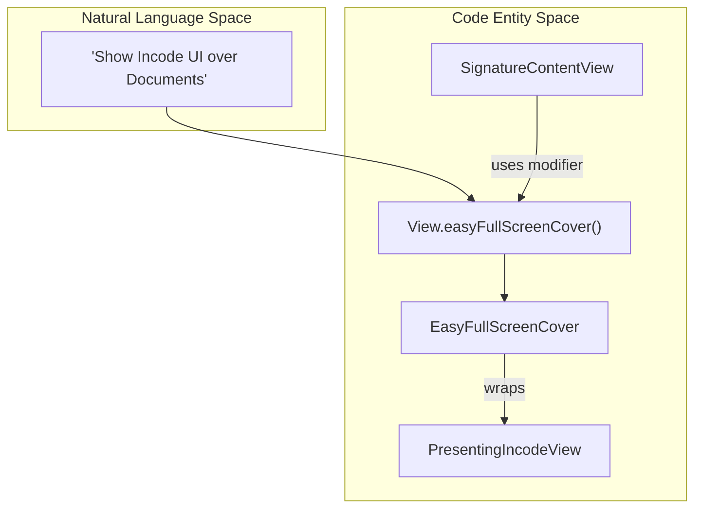
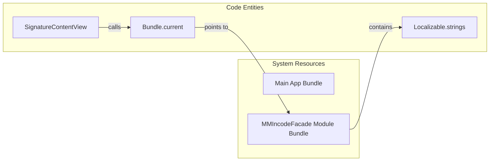

# Extensions & Helpers

# Extensions & Helpers

Relevant source files

The following files were used as context for generating this wiki page:

- [README.md](README.md)
- [Sources/Frameworks/IncdOnboarding.xcframework/ios-arm64/IncdOnboarding.framework/Assets.car](Sources/Frameworks/IncdOnboarding.xcframework/ios-arm64/IncdOnboarding.framework/Assets.car)

The `MMIncodeFacade` library includes several utility extensions designed to bridge SwiftUI with UIKit, simplify view presentation, and handle resource management within the Swift Package module. These helpers are primarily located in the `Shared` directory and support the core signature flow by providing type conversions and convenience modifiers.

## Color Conversion

The `Color` extension provides a bridge between SwiftUI's `Color` and UIKit's `UIColor`. This is essential for the [Theming System](2.3.-Theming-System) because the underlying Incode SDK is built on UIKit and requires `UIColor` for its `ColorsConfiguration`.

### Implementation
The extension uses a private helper method to extract the underlying `UIColor` from a SwiftUI `Color` instance. This is used by `ThemeColors` to transform the facade's theme definitions into a format the SDK understands.

| Method | Return Type | Description |
| :--- | :--- | :--- |
| `toUIColor()` | `UIColor` | Converts a SwiftUI `Color` to a `UIColor`. |

**Sources:**
* [Sources/MMIncodeFacade/Shared/Extensions/Color+Extension.swift:1-12]()
* [Sources/MMIncodeFacade/Models/ThemeColors.swift:30-45]() (Usage in `toThemeConfiguration`)

---

## Easy Full Screen Cover Modifier

To simplify the presentation of the Incode SDK UI over the document preview, the library provides a convenience `View` extension. This wraps the `EasyFullScreenCover` view, which handles custom modal presentations with an environment-based dismissal mechanism.

### Data Flow: Presentation Logic
The following diagram illustrates how the convenience modifier bridges the Natural Language request ("Show the SDK") to the internal SwiftUI View hierarchy.

**Title: Full Screen Cover Presentation Flow**

### Key Functions
* **`easyFullScreenCover(isPresented:content:)`**: A `View` modifier that mimics the standard SwiftUI `fullScreenCover` but utilizes the custom `EasyFullScreenCover` implementation to ensure proper lifecycle management of the Incode SDK's view controllers.

**Sources:**
* [Sources/MMIncodeFacade/Shared/Extensions/View+Extension.swift:1-14]()
* [Sources/MMIncodeFacade/Shared/Views/EasyFullScreenCover.swift:1-30]()
* [Sources/MMIncodeFacade/Views/SignatureContentView.swift:50-55]() (Usage site)

---

## Bundle Management

Because `MMIncodeFacade` is distributed as a Swift Package, accessing assets (like localizable strings or images) requires referencing the correct module bundle. The `Bundle` extension provides a static property to ensure the library looks within its own resources rather than the main application bundle.

### Implementation
The `Bundle.current` property is used throughout the UI layer, particularly for loading localizable strings required by the Incode SDK and the document preview headers.

**Title: Asset Lookup Mapping**

**Sources:**
* [Sources/MMIncodeFacade/Shared/Extensions/Bundle+Extension.swift:1-10]()
* [Sources/MMIncodeFacade/Views/SignatureContentView.swift:20-30]() (Usage for localized strings)

---

## Summary of Utility Roles

| Helper | Role | Key File |
| :--- | :--- | :--- |
| `Color.toUIColor` | Enables dynamic theming of the UIKit-based SDK using SwiftUI `Color` definitions. | [Sources/MMIncodeFacade/Shared/Extensions/Color+Extension.swift]() |
| `View.easyFullScreenCover` | Provides a clean API for presenting the `PresentingIncodeView` bridge. | [Sources/MMIncodeFacade/Shared/Extensions/View+Extension.swift]() |
| `Bundle.current` | Resolves the correct resource path for the library's internal assets. | [Sources/MMIncodeFacade/Shared/Extensions/Bundle+Extension.swift]() |

**Sources:**
* [Sources/MMIncodeFacade/Shared/Extensions/Color+Extension.swift:1-12]()
* [Sources/MMIncodeFacade/Shared/Extensions/View+Extension.swift:1-14]()
* [Sources/MMIncodeFacade/Shared/Extensions/Bundle+Extension.swift:1-10]()

---