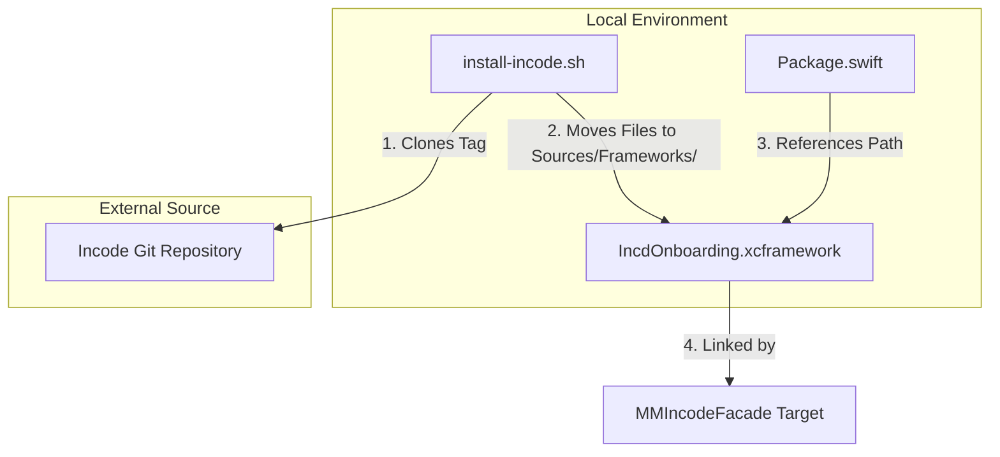
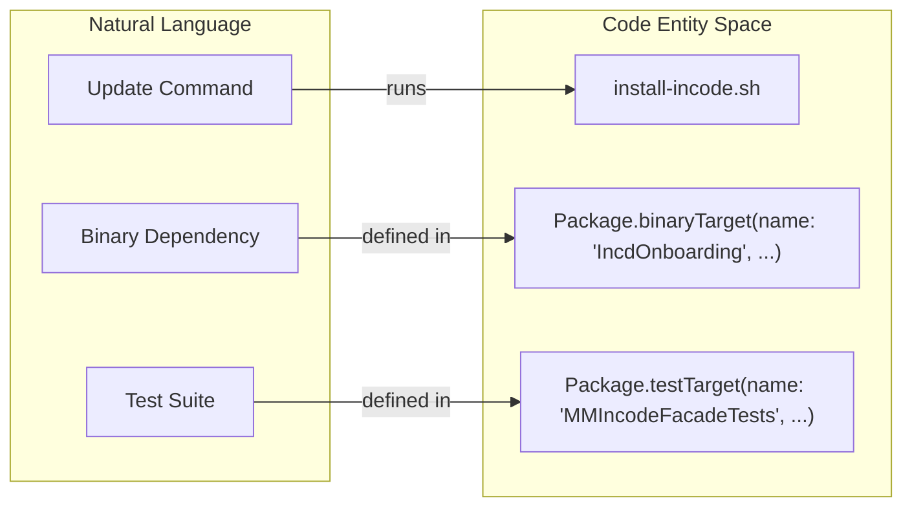

# Framework Management & CI

# Framework Management & CI

Relevant source files

The following files were used as context for generating this wiki page:

- [.gitignore](.gitignore)
- [Package.swift](Package.swift)
- [README.md](README.md)

This page provides a high-level overview of the automation and configuration strategies used to maintain the `MMIncodeFacade` repository. It focuses on the lifecycle of the third-party `IncdOnboarding.xcframework` and the project's continuous integration environment.

## Overview

The `MMIncodeFacade` project relies on a bundled binary dependency that must be manually updated when new versions are released by Incode. To streamline this, the repository includes automation scripts and specific version pinning strategies to ensure build reproducibility.

The management of the framework is governed by:
1.  **Automation Scripts**: Located in the `install-frameworks/` directory to handle binary downloads.
2.  **SPM Configuration**: Defining how the binary is linked to the facade source.
3.  **Git Hygiene**: Specific ignore rules to keep the repository clean of build artifacts.

### Framework Lifecycle Diagram

This diagram illustrates the relationship between the management script, the local file system, and the Swift Package Manager configuration.

**Framework Update Workflow**

**Sources:** [Package.swift:23-26](), [README.md:121-128]()

## Automation & Updating

The primary tool for managing the Incode SDK is the `install-incode.sh` script. This script automates the process of fetching a specific release from Incode's distribution channels and placing the `.xcframework` in the correct directory for the Swift Package Manager to locate it.

The script follows a "Git clone and file-move" workflow:
*   It accepts a `RELEASE_TAG` as a parameter.
*   It cleans existing framework directories to prevent version conflicts.
*   It updates the local `Sources/Frameworks/IncdOnboarding.xcframework` which is then consumed by the `binaryTarget` in `Package.swift`.

For details on executing these updates and verifying the integrity of the new SDK version, see **[Updating the Incode SDK](#6.1)**.

**Sources:** [README.md:121-128](), [Package.swift:23-26]()

## Testing Strategy

The repository includes a dedicated test target, `MMIncodeFacadeTests`, which is configured to depend on the main facade library. 

*   **Integration Testing**: Tests are designed to verify the facade's logic and the orchestration of the onboarding flow.
*   **Simulator Support**: Because the Incode SDK requires hardware cameras for many features, the `INCodeParams` object includes a `testMode` flag. When set to `true`, this allows for limited testing within simulator environments without triggering hardware-related failures.

For details on writing tests and utilizing the test mode, see **[Testing](#6.2)**.

**Sources:** [Package.swift:31-34](), [README.md:26-30]()

## Git Configuration

The project maintains a standard `.gitignore` configuration optimized for Swift Package Manager and Xcode development. This ensures that transient build data and local user configurations are not committed to the repository, while ensuring the large `.xcframework` (which is required for the package to build) is properly tracked if not excluded by local policy.

| Pattern | Purpose |
| :--- | :--- |
| `.build` | Prevents committing SPM checkout and build artifacts. |
| `DerivedData/` | Excludes Xcode's intermediate build files and indexes. |
| `.swiftpm/` | Excludes local Swift Package Manager configuration. |
| `*.xcodeproj` | Prevents committing generated Xcode projects (when using SPM-only workflows). |

**Sources:** [.gitignore:1-8]()

## Code Entity Mapping

This diagram bridges the natural language concepts of "Management" to the specific code entities defined in the package configuration.

**Management Entity Mapping**

**Sources:** [Package.swift:23-35](), [README.md:127-127]()

---