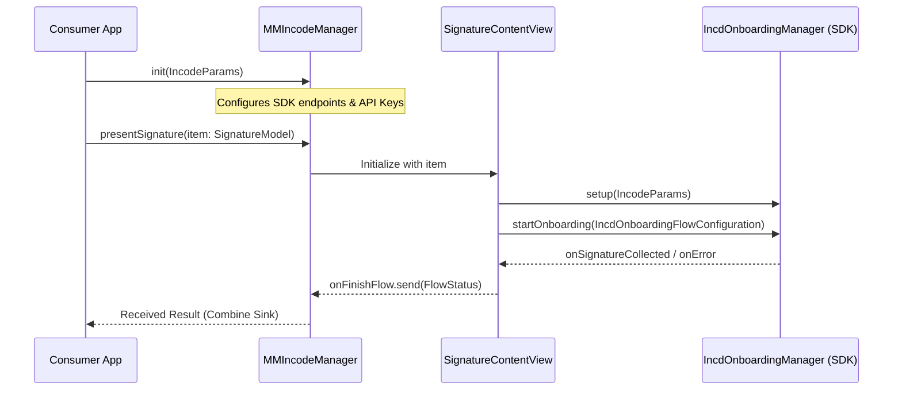

# Getting Started

# Getting Started

<details>
<summary>Relevant source files</summary>

The following files were used as context for generating this wiki page:

- [Package.swift](Package.swift)
- [README.md](README.md)

</details>


This guide provides a step-by-step walkthrough for integrating the `MMIncodeFacade` library into your iOS application. The facade simplifies interaction with the Incode Onboarding SDK, providing a streamlined Combine-based interface for document signature flows.

## Prerequisites

Before beginning the integration, ensure your environment meets the following requirements:

*   **iOS Version**: The library supports **iOS 14.0** and later [Package.swift:9-9]().
*   **Swift Version**: Requires Swift 5.7 or higher [Package.swift:1-1]().
*   **Architecture**: The bundled `IncdOnboarding.xcframework` supports both `ios-arm64` for physical devices and `ios-arm64_x86_64-simulator` for Intel/Apple Silicon simulators [Package.swift:23-26]().

## Installation via Swift Package Manager (SPM)

To add `MMIncodeFacade` to your Xcode project:

1.  Open your project in Xcode.
2.  Navigate to **File > Add Packages...**.
3.  Enter the repository URL: `https://github.com/Akrostechnologies/MM-IncodeFacade`.
4.  Select the version or branch you wish to use and click **Add Package**.
5.  Ensure the `MMIncodeFacade` target is added to your application target [README.md:8-13]().

## Integration Steps

The integration involves initializing the manager, setting up Combine observers for flow results, and presenting the signature UI.

### 1. Initialize MMIncodeManager

The `MMIncodeManager` is the primary entry point. It requires an `IncodeParams` object containing your API credentials and environment configuration.

| Parameter | Type | Description |
| :--- | :--- | :--- |
| `urlString` | `String` | The base URL for the Incode API services. |
| `apiKey` | `String` | Your unique Incode API key. |
| `testMode` | `Bool` | Enable this for simulator testing. Note: Hardware camera features are limited in this mode. |

**Sources:** [README.md:26-30]()

### 2. Configure the Signature Model

Define the documents that need to be signed using `DocumentModel` and wrap them in a `SignatureModel`.

```swift
let documents: [DocumentModel] = [
    .init(title: "Document 1", urlString: "https://example.com/doc1.pdf"),
    .init(title: "Document 2", urlString: "https://example.com/doc2.pdf")
]

let signatureItem = SignatureModel(documents: documents)
```
**Sources:** [README.md:54-74]()

### 3. Implementation Example

The following diagram illustrates the data flow between your application's ViewModel and the `MMIncodeFacade` entities.

#### Entity Relationship and Data Flow
```mermaid
graph TD
    subgraph "Consumer App (Natural Language Space)"
        VM["ViewModel"]
        CV["ContentView"]
    end

    subgraph "MMIncodeFacade (Code Entity Space)"
        MGR["MMIncodeManager"]
        PARAMS["IncodeParams"]
        SIG_MOD["SignatureModel"]
        DOC_MOD["DocumentModel"]
        FLOW["FlowStatus (Enum)"]
    end

    VM -->| "1. Initialize with" | PARAMS
    PARAMS --> MGR
    VM -->| "2. Create" | SIG_MOD
    SIG_MOD -->| "contains" | DOC_MOD
    CV -->| "3. Calls presentSignature(item:)" | MGR
    MGR -->| "4. Publishes result via onFinishFlow" | FLOW
    FLOW -->| "5. Sink/Observe" | VM
```
**Sources:** [README.md:21-52](), [README.md:81-101]()

#### Code Implementation

Create a ViewModel to manage the `MMIncodeManager` instance and handle the `onFinishFlow` publisher.

```swift
import SwiftUI
import Combine
import MMIncodeFacade

class SignatureViewModel: ObservableObject {
    var cancellables = Set<AnyCancellable>()
    @Published var isShowingSignature = false
    
    // Initialize the Manager
    let manager = MMIncodeManager(IncodeParams(
        urlString: "https://api.your-incode-url.com",
        apiKey: "YOUR_API_KEY",
        testMode: false
    ))

    init() {
        setupBindings()
    }

    private func setupBindings() {
        // Observe flow completion
        manager.onFinishFlow
            .receive(on: DispatchQueue.main)
            .sink { [weak self] result in
                switch result {
                case .success(let documents):
                    print("Successfully signed: \(documents)")
                case .userFinish:
                    print("User closed the flow")
                case .error(let message):
                    print("Error occurred: \(message)")
                default: break
                }
                self?.isShowingSignature = false
            }.store(in: &cancellables)
    }
}
```
**Sources:** [README.md:21-52]()

### 4. Presenting the UI

Use the `presentSignature(item:)` method within a SwiftUI view. This method returns a view that handles the document preview and the Incode SDK's signature capture.

```swift
struct MyView: View {
    @StateObject private var viewModel = SignatureViewModel()

    var body: some View {
        Button("Start Signing") {
            viewModel.isShowingSignature = true
        }
        .fullScreenCover(isPresented: $viewModel.isShowingSignature) {
            // Present the facade's signature flow
            viewModel.manager.presentSignature(
                item: viewModel.buildSignatureModel()
            )
        }
    }
}
```
**Sources:** [README.md:81-101]()

## Internal Initialization Sequence

The following sequence diagram details how `MMIncodeManager` bridges the consumer request to the underlying `IncdOnboarding` framework.


**Sources:** [README.md:26-52](), [Package.swift:23-30]()

---