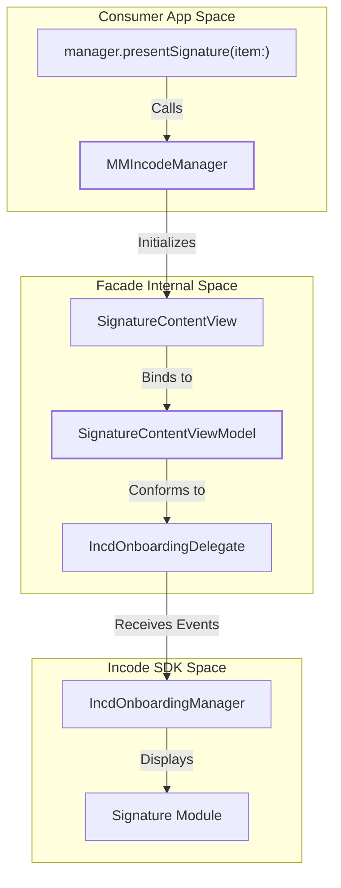
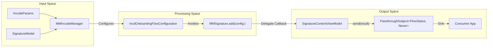

# Glossary

# Glossary

Relevant source files

The following files were used as context for generating this wiki page:

- [Package.swift](Package.swift)
- [README.md](README.md)
- [Sources/Frameworks/IncdOnboarding.xcframework/Info.plist](Sources/Frameworks/IncdOnboarding.xcframework/Info.plist)
- [Sources/Frameworks/IncdOnboarding.xcframework/ios-arm64/IncdOnboarding.framework/Antifraud.storyboardc/AntifraudViewController.nib](Sources/Frameworks/IncdOnboarding.xcframework/ios-arm64/IncdOnboarding.framework/Antifraud.storyboardc/AntifraudViewController.nib)
- [Sources/Frameworks/IncdOnboarding.xcframework/ios-arm64/IncdOnboarding.framework/Assets.car](Sources/Frameworks/IncdOnboarding.xcframework/ios-arm64/IncdOnboarding.framework/Assets.car)
- [Sources/Frameworks/IncdOnboarding.xcframework/ios-arm64/IncdOnboarding.framework/BarcodeScan.storyboardc/BarcodeScanViewController.nib/objects-13.0+.nib](Sources/Frameworks/IncdOnboarding.xcframework/ios-arm64/IncdOnboarding.framework/BarcodeScan.storyboardc/BarcodeScanViewController.nib/objects-13.0+.nib)
- [Sources/Frameworks/IncdOnboarding.xcframework/ios-arm64/IncdOnboarding.framework/CURPValidation.storyboardc/CURPValidationViewController.nib](Sources/Frameworks/IncdOnboarding.xcframework/ios-arm64/IncdOnboarding.framework/CURPValidation.storyboardc/CURPValidationViewController.nib)
- [Sources/Frameworks/IncdOnboarding.xcframework/ios-arm64/IncdOnboarding.framework/CircularXXTT-Black.ttf](Sources/Frameworks/IncdOnboarding.xcframework/ios-arm64/IncdOnboarding.framework/CircularXXTT-Black.ttf)

This page provides a comprehensive reference for terms, domain concepts, and code entities specific to the `MMIncodeFacade` project. It serves as a technical bridge for onboarding engineers to understand how natural language concepts map to specific implementation details within the codebase.

## System Domain Terms

| Term | Definition | Code Pointer |
| :--- | :--- | :--- |
| **Facade** | The structural pattern used to wrap the complex Incode SDK into a simplified, event-driven interface for consumer applications. | `MMIncodeManager` [Sources/MMIncodeFacade/MMIncodeManager.swift:15-17]() |
| **Signature Flow** | The end-to-end process of presenting a document preview, capturing a user's digital signature via the SDK, and returning the result. | `SignatureContentView` [Sources/MMIncodeFacade/Signature/SignatureContentView.swift:11-13]() |
| **Onboarding SDK** | The binary `IncdOnboarding.xcframework` which contains the core logic for identity verification and biometric capture. | `IncdOnboarding` [Package.swift:23-26]() |
| **Test Mode** | A configuration flag that allows the SDK to run on an iOS Simulator by bypassing hardware camera requirements. | `IncodeParams.testMode` [Sources/MMIncodeFacade/Data/IncodeParams.swift:11-11]() |

**Sources:** [Sources/MMIncodeFacade/MMIncodeManager.swift:1-50](), [Package.swift:1-36]()

---

## Code Entity Mapping

The following diagrams illustrate the relationship between high-level system operations and the specific classes or functions that execute them.

### Signature Flow Execution
This diagram bridges the "Start Signature" command to the internal orchestration logic.

**Sources:** [Sources/MMIncodeFacade/MMIncodeManager.swift:68-75](), [Sources/MMIncodeFacade/Signature/SignatureContentViewModel.swift:11-15](), [Sources/MMIncodeFacade/Signature/SignatureContentView.swift:28-35]()

### Data Flow & Event Model
This diagram shows how data moves from the input parameters to the final Combine emission.

**Sources:** [Sources/MMIncodeFacade/MMIncodeManager.swift:37-45](), [Sources/MMIncodeFacade/Signature/SignatureContentViewModel.swift:76-85](), [Sources/MMIncodeFacade/Signature/MMSignature.swift:12-20]()

---

## Technical Abbreviations & SDK Types

### SDK Core Types
*   **`IncdOnboardingManager`**: The singleton instance within the binary framework responsible for the lifecycle of the onboarding session [Sources/MMIncodeFacade/MMIncodeManager.swift:42-42]().
*   **`IncdOnboardingDelegate`**: The protocol implemented by `SignatureContentViewModel` to listen for SDK events like `onSignatureCollected` or `userCancelledSession` [Sources/MMIncodeFacade/Signature/SignatureContentViewModel.swift:63-65]().
*   **`IncdOnboardingFlowConfiguration`**: The object used to define which modules (e.g., Signature, ID Capture) are included in the current session [Sources/MMIncodeFacade/Signature/MMSignature.swift:14-16]().

### Result Enums
*   **`FlowStatus`**: A facade-specific enum that abstracts SDK results into `success`, `error`, or `userFinish` [Sources/MMIncodeFacade/MMIncodeManager.swift:20-25]().

### Resource Identifiers
*   **`Assets.car`**: The compiled asset catalog inside `IncdOnboarding.framework` containing all UI icons and overlays [Sources/Frameworks/IncdOnboarding.xcframework/ios-arm64/IncdOnboarding.framework/Assets.car:1-10]().
*   **`Antifraud.storyboardc`**: Compiled storyboard for the Antifraud module used during the onboarding process [Sources/Frameworks/IncdOnboarding.xcframework/ios-arm64/IncdOnboarding.framework/Antifraud.storyboardc/AntifraudViewController.nib:23-23]().

**Sources:** [Sources/MMIncodeFacade/MMIncodeManager.swift:15-30](), [Sources/MMIncodeFacade/Signature/SignatureContentViewModel.swift:60-90](), [Sources/MMIncodeFacade/Signature/MMSignature.swift:10-25]()

---

## Domain Concepts Reference Table

| Concept | Implementation Detail | Role |
| :--- | :--- | :--- |
| **Document Preview** | `PDFKitView` | Uses Apple's `PDFKit` to render the documents before the user signs [Sources/MMIncodeFacade/Shared/PDFKitView.swift:10-12](). |
| **Theme Mapping** | `ThemeColors.toThemeConfiguration()` | Converts facade `Color` objects into `IncdOnboarding.ColorsConfiguration` for the SDK [Sources/MMIncodeFacade/Theme/ThemeColors.swift:20-25](). |
| **Full Screen Presentation** | `EasyFullScreenCover` | A custom SwiftUI modifier that manages the presentation of the Incode UIViewController over the SwiftUI hierarchy [Sources/MMIncodeFacade/Shared/EasyFullScreenCover.swift:10-15](). |
| **Bridge View** | `PresentingIncodeView` | A `UIViewControllerRepresentable` that provides the necessary `UIViewController` context for the SDK to present its UI [Sources/MMIncodeFacade/Shared/PresentingIncodeView.swift:10-12](). |

**Sources:** [Sources/MMIncodeFacade/Shared/PDFKitView.swift:1-25](), [Sources/MMIncodeFacade/Theme/ThemeColors.swift:1-35](), [Sources/MMIncodeFacade/Shared/EasyFullScreenCover.swift:1-40]()