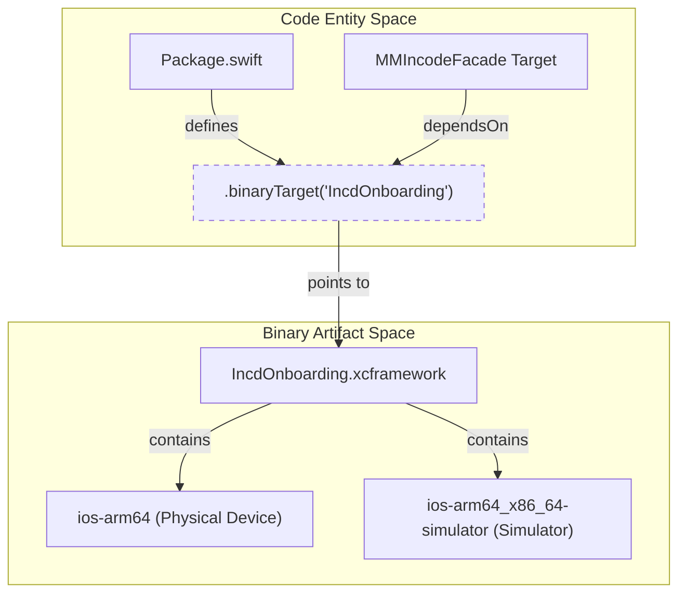
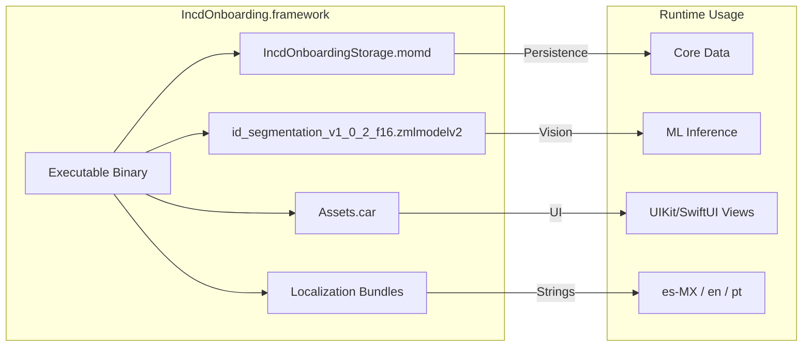

# IncdOnboarding SDK Reference

# IncdOnboarding SDK Reference

Relevant source files

The following files were used as context for generating this wiki page:

- [Package.swift](Package.swift)
- [Sources/Frameworks/IncdOnboarding.xcframework/Info.plist](Sources/Frameworks/IncdOnboarding.xcframework/Info.plist)

The `IncdOnboarding.xcframework` is a bundled binary dependency that provides the core biometric and document processing capabilities for the `MMIncodeFacade`. It is integrated as a `.binaryTarget` within the Swift Package Manager (SPM) manifest [Package.swift:23-26]().

This reference section provides a high-level overview of the SDK's internal composition, including its multi-architecture support, functional modules, and bundled assets.

### SDK Integration Architecture

The SDK is delivered as an XCFramework, allowing it to support multiple CPU architectures and platform variants within a single bundle. The `MMIncodeFacade` target declares a direct dependency on this binary [Package.swift:27-30](), which enables the use of the `IncdOnboarding` module throughout the facade's source code.

#### Logical Mapping: SPM to Binary
The following diagram illustrates how the Swift Package Manager resolves the `IncdOnboarding` dependency defined in the codebase to the physical binary slices.

**SPM Dependency Resolution**

Sources: [Package.swift:23-30](), [Sources/Frameworks/IncdOnboarding.xcframework/Info.plist:5-34]()

---

### XCFramework Structure & Architecture
The `IncdOnboarding.xcframework` uses a standard Apple distribution format that includes two distinct library slices:
*   **ios-arm64**: Targeted at physical iOS devices [Sources/Frameworks/IncdOnboarding.xcframework/Info.plist:24-33]().
*   **ios-arm64_x86_64-simulator**: A fat binary supporting both Intel and Apple Silicon Macs for simulator testing [Sources/Frameworks/IncdOnboarding.xcframework/Info.plist:9-21]().

For a detailed breakdown of the bundle layout, including the `Headers/` directory and `swiftmodule` configurations, see **[XCFramework Structure & Architecture](#5.1)**.

Sources: [Sources/Frameworks/IncdOnboarding.xcframework/Info.plist:1-40]()

---

### Onboarding Module Inventory
The SDK is composed of several specialized UI and logic modules. These modules are compiled into the framework and can be orchestrated via the `IncdOnboardingFlowConfiguration`. Key modules include:
*   **Identification**: `IDCapture`, `IDResults`, `INEValidation`, and `CURPValidation`.
*   **Biometrics**: `VideoSelfie`, `Antifraud`, and `FaceScan`.
*   **Verification**: `OTPVerification`, `Captcha`, and `WatchlistValidation`.
*   **Compliance**: `UserConsent`, `Signature`, and `Geolocation`.

For a complete catalog of available modules and their specific view controllers (e.g., `BarcodeScanViewController`), see **[Onboarding Module Inventory](#5.2)**.

Sources: [Package.swift:23-26]()

---

### SDK Resources & Assets
Beyond executable code, the SDK contains a variety of non-code resources required for the onboarding UI:
*   **Graphics**: `Assets.car` for icons and UI overlays.
*   **Typography**: The `CircularXXTT` font family.
*   **Media**: MP4 tutorial videos (e.g., `tutorial_selfie.mp4`) and ID processing animations.
*   **Models**: Core Data models (`IncdOnboardingStorage.momd`) and Machine Learning models for segmentation.
*   **Localization**: Bundle support for English (`en`), Spanish (`es`), and Portuguese (`pt`).

For a detailed list of file paths and resource purposes, see **[SDK Resources & Assets](#5.3)**.

#### Resource Interaction Map
This diagram shows how the `IncdOnboarding` binary links internal resources to the runtime environment.

**SDK Internal Resources**

Sources: [Package.swift:8-9](), [Sources/Frameworks/IncdOnboarding.xcframework/Info.plist:35-38]()

---