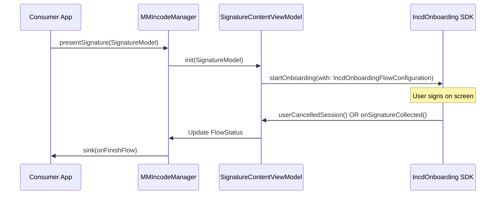

# MMIncodeManager

# MMIncodeManager

<details>
<summary>Relevant source files</summary>

The following files were used as context for generating this wiki page:

- [Package.swift](Package.swift)
- [README.md](README.md)

</details>


The `MMIncodeManager` class serves as the primary entry point and central orchestrator for the `MMIncodeFacade` library. It abstracts the complexities of the Incode SDK initialization, configuration, and flow management, providing a simplified interface for consumer applications to trigger document signature sessions.

### Purpose and Scope
`MMIncodeManager` handles the lifecycle of the Incode SDK integration, from bootstrapping the `IncdOnboardingManager` to emitting flow results via Combine. It encapsulates the transformation of domain-specific parameters (`IncodeParams`) into SDK-ready configurations and manages the presentation of the signature UI.

---

## Initialization and Bootstrapping

The manager is initialized with an `IncodeParams` object, which contains essential credentials and environment settings. During `init`, the manager immediately bootstraps the underlying `IncdOnboardingManager` singleton.

| Parameter | Description |
| :--- | :--- |
| `urlString` | The base URL for the Incode API services. |
| `apiKey` | The unique identifier for the client application. |
| `testMode` | A boolean flag; when `true`, it allows the SDK to run on simulators without hardware camera access. |
| `theme` | Optional custom `ThemeColors` to override the default UI appearance. |

### SDK Bootstrapping Logic
The initialization process calls `IncdOnboardingManager.shared.initIncdOnboarding` using the provided parameters. It also configures global SDK settings such as logging and theme configurations derived from `ThemeColors`.

**Sources:**
- [Sources/MMIncodeFacade/MMIncodeManager.swift:23-42]() (Class definition and init)
- [Sources/MMIncodeFacade/Models/IncodeParams.swift:9-24]() (IncodeParams structure)

---

## Core Components

### FlowStatus Enum
The `FlowStatus` enum communicates the outcome of a signature session to the consumer application.

- `.success([DocumentModel])`: The user successfully signed all documents.
- `.userFinish`: The user completed the flow but no specific document data was returned (often used for simple completion).
- `.error(String)`: An error occurred during the session, containing a descriptive message.
- `.none`: The default state before a flow begins.

### onFinishFlow PassthroughSubject
The manager exposes an `onFinishFlow` property, which is a `PassthroughSubject<FlowStatus, Never>`. Consumer applications subscribe to this subject to receive asynchronous updates when a signature session terminates.

**Sources:**
- [Sources/MMIncodeFacade/MMIncodeManager.swift:18-21]() (Subject and Enum definition)

---

## Signature Session Lifecycle

The primary method for starting a session is `presentSignature(item:)`. This method returns a SwiftUI `View` that manages the internal state and UI transitions for the signature process.

### Implementation Flow
1. **Request**: The consumer calls `presentSignature(item:)` passing a `SignatureModel`.
2. **View Creation**: The manager instantiates a `SignatureContentView`, injecting a `SignatureContentViewModel`.
3. **State Management**: The `SignatureContentViewModel` coordinates with the `IncdOnboardingDelegate` to track progress.
4. **Completion**: Once the SDK finishes (success, cancel, or error), the internal delegate notifies the `MMIncodeManager` via the `onFinishFlow` subject.

### Data Flow Diagram: Natural Language to Code Entities
The following diagram maps the conceptual "Signature Request" to the specific code entities involved in the execution.

**Signature Flow Orchestration**
```mermaid
graph TD
    subgraph "Consumer Space"
        A["App Logic"] -- "1. Calls presentSignature(item:)" --> B["MMIncodeManager"]
        B -- "5. Emits FlowStatus" --> C["onFinishFlow (PassthroughSubject)"]
    end

    subgraph "Code Entity Space (Facade)"
        B -- "2. Creates" --> D["SignatureContentView"]
        D -- "3. Uses" --> E["SignatureContentViewModel"]
        E -- "4. Implements" --> F["IncdOnboardingDelegate"]
    end

    subgraph "SDK Space"
        F -- "Events" <-> G["IncdOnboardingManager (SDK)"]
    end
```
**Sources:**
- [Sources/MMIncodeFacade/MMIncodeManager.swift:44-55]() (`presentSignature` implementation)
- [Sources/MMIncodeFacade/Signature/SignatureContentViewModel.swift:11-25]() (ViewModel role)

---

## Internal Lifecycle of a Signature Session

When `presentSignature` is invoked, the manager bridges the gap between SwiftUI and the UIKit-based Incode SDK.

### The Signature Process
The manager utilizes `SignatureModel` to define the documents to be displayed. Internally, it relies on `MMSignature` to configure the Incode "Signature" module.

**Lifecycle Sequence**


### Technical Detail: Presenting the SDK
The manager ensures the SDK is presented correctly using a `UIViewControllerRepresentable` bridge (via `PresentingIncodeView`). This allows the Incode SDK's `UIViewController` to be hosted within the SwiftUI hierarchy generated by `presentSignature`.

**Sources:**
- [Sources/MMIncodeFacade/Signature/MMSignature.swift:10-25]() (SDK Flow Configuration)
- [Sources/MMIncodeFacade/Shared/Views/PresentingIncodeView.swift:10-30]() (UIKit Bridge)
- [Sources/MMIncodeFacade/MMIncodeManager.swift:48-54]() (View Assembly)

---

## Key Functions Reference

| Function | Description |
| :--- | :--- |
| `init(_ params: IncodeParams)` | Configures the `IncdOnboardingManager` singleton with API keys and URL. Sets the global theme. |
| `presentSignature(item: SignatureModel) -> some View` | Returns a `SignatureContentView` configured with the provided documents and the manager's theme. |
| `onFinishFlow` | A Combine subject used to observe the terminal state of the signature flow. |

**Sources:**
- [Sources/MMIncodeFacade/MMIncodeManager.swift:13-56]() (Entire Class)
- [README.md:26-52]() (Usage Example)

---