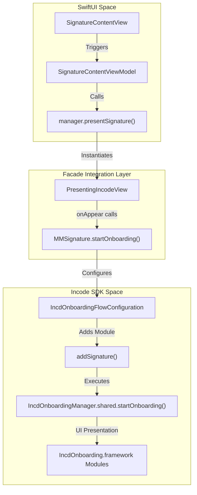
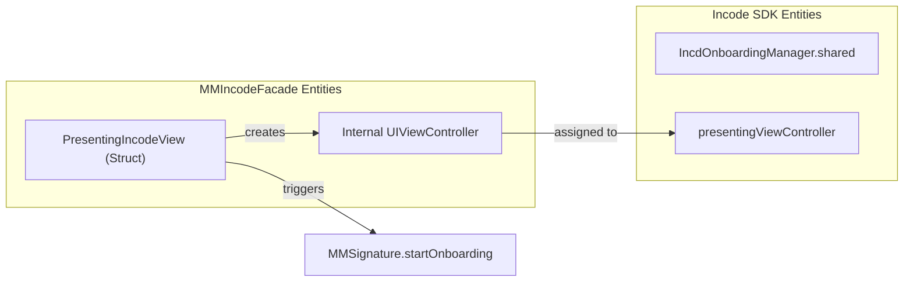

# MMSignature & SDK Integration

# MMSignature & SDK Integration

Relevant source files

The following files were used as context for generating this wiki page:

- [README.md](README.md)
- [Sources/Frameworks/IncdOnboarding.xcframework/ios-arm64/IncdOnboarding.framework/Antifraud.storyboardc/AntifraudViewController.nib](Sources/Frameworks/IncdOnboarding.xcframework/ios-arm64/IncdOnboarding.framework/Antifraud.storyboardc/AntifraudViewController.nib)

This page details the internal integration between the `MMIncodeFacade` and the `IncdOnboarding` SDK. It focuses on how the facade wraps the SDK's signature module, the bridge between SwiftUI and UIKit for presenting the SDK UI, and the orchestration of the onboarding flow.

## Overview of the Integration Layer

The integration relies on three primary components to bridge the facade's high-level API with the Incode SDK's internal modules:

1.  **`MMSignature`**: An internal configuration wrapper that defines how the Incode Signature module should behave.
2.  **`PresentingIncodeView`**: A `UIViewControllerRepresentable` bridge that provides the SDK with a valid `UIViewController` context for presentation.
3.  **`IncdOnboardingManager`**: The singleton instance within the Incode SDK used to start the flow and manage the session lifecycle.

### Data Flow Diagram: SDK Invocation

The following diagram illustrates how a call to `presentSignature` traverses the facade to trigger the Incode SDK.

**Signature Invocation Path**

**Sources:** [Sources/MMIncodeFacade/MMIncodeManager.swift:85-91](), [Sources/MMIncodeFacade/Signature/MMSignature.swift:10-25](), [Sources/MMIncodeFacade/Shared/PresentingIncodeView.swift:10-25]()

---

## The MMSignature Class

The `MMSignature` class serves as the internal bridge to the `IncdOnboarding` SDK's configuration system. It encapsulates the logic for setting up a specific "onboarding flow" that consists solely of the signature step.

### Key Implementation Details
*   **Configuration Wrapping**: It uses `IncdOnboardingFlowConfiguration` to define the sequence of steps.
*   **Module Injection**: It calls `.addSignature()` on the configuration object to include the signature UI module.
*   **SDK Handover**: It invokes `IncdOnboardingManager.shared.startOnboarding` to begin the process.

| Method | Purpose |
| :--- | :--- |
| `startOnboarding(delegate:config:)` | Static method that initializes the SDK flow with the provided delegate and session configuration. |

**Sources:** [Sources/MMIncodeFacade/Signature/MMSignature.swift:10-33]()

---

## PresentingIncodeView: The UIKit Bridge

The Incode SDK is built on UIKit and requires a `presentingViewController` to display its storyboards (such as `Antifraud.storyboardc` or `Signature` modules). Since `MMIncodeFacade` is designed for SwiftUI, `PresentingIncodeView` acts as the `UIViewControllerRepresentable` bridge.

### UIViewControllerRepresentable Logic
The bridge performs a critical hand-off during the SwiftUI lifecycle:
1.  **`makeUIViewController`**: Creates a standard `UIViewController`.
2.  **`updateUIViewController`**: Captures the created controller and assigns it to `IncdOnboardingManager.shared.presentingViewController`. This ensures the SDK knows where to modally present its screens.
3.  **Flow Trigger**: Once the view controller is ready, it calls `MMSignature.startOnboarding`.

**Component Mapping**

**Sources:** [Sources/MMIncodeFacade/Shared/PresentingIncodeView.swift:10-35](), [Sources/MMIncodeFacade/Signature/MMSignature.swift:20-30]()

---

## SDK Module Invocation

When `MMSignature.startOnboarding` is called, it interacts with the bundled `IncdOnboarding.xcframework`. The SDK contains various pre-compiled modules that are invoked based on the `IncdOnboardingFlowConfiguration`.

### Signature Module Execution
The SDK loads resources from the framework, including:
*   **UI Components**: Storyboards and NIBs (e.g., `AntifraudViewController.nib`).
*   **Localization**: String keys like `incdOnboarding.signature.title` are used to populate the UI.
*   **Assets**: Compiled assets (`Assets.car`) for the signature pad and buttons.

### Implementation Summary Table

| Step | Entity | Action |
| :--- | :--- | :--- |
| **1. Init** | `MMIncodeManager` | Receives `IncodeParams` and initializes the SDK environment. |
| **2. Prep** | `PresentingIncodeView` | Bridges the SwiftUI hierarchy to UIKit. |
| **3. Config** | `IncdOnboardingFlowConfiguration` | Defines the flow via `addSignature()`. |
| **4. Launch** | `IncdOnboardingManager` | Calls `startOnboarding` using the assigned `presentingViewController`. |

**Sources:** [Sources/MMIncodeFacade/MMIncodeManager.swift:20-35](), [Sources/MMIncodeFacade/Signature/MMSignature.swift:10-25](), [Sources/Frameworks/IncdOnboarding.xcframework/ios-arm64/IncdOnboarding.framework/Antifraud.storyboardc/AntifraudViewController.nib:1-35]()

---