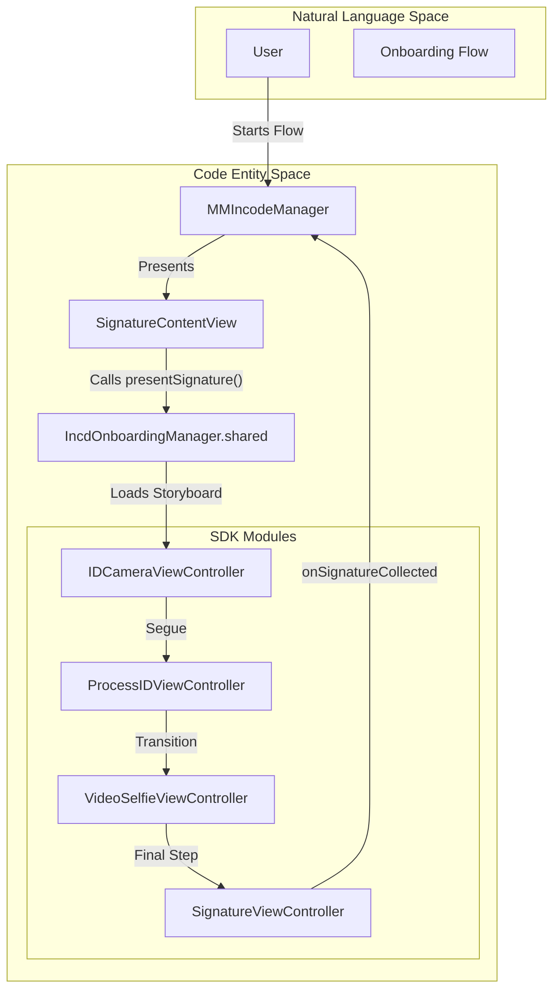

# Onboarding Module Inventory

# Onboarding Module Inventory

<details>
<summary>Relevant source files</summary>

The following files were used as context for generating this wiki page:

- [Sources/Frameworks/IncdOnboarding.xcframework/ios-arm64/IncdOnboarding.framework/Antifraud.storyboardc/AntifraudViewController.nib](Sources/Frameworks/IncdOnboarding.xcframework/ios-arm64/IncdOnboarding.framework/Antifraud.storyboardc/AntifraudViewController.nib)
- [Sources/Frameworks/IncdOnboarding.xcframework/ios-arm64/IncdOnboarding.framework/Antifraud.storyboardc/Info.plist](Sources/Frameworks/IncdOnboarding.xcframework/ios-arm64/IncdOnboarding.framework/Antifraud.storyboardc/Info.plist)
- [Sources/Frameworks/IncdOnboarding.xcframework/ios-arm64/IncdOnboarding.framework/BarcodeScan.storyboardc/BarcodeScanViewController.nib/objects-13.0+.nib](Sources/Frameworks/IncdOnboarding.xcframework/ios-arm64/IncdOnboarding.framework/BarcodeScan.storyboardc/BarcodeScanViewController.nib/objects-13.0+.nib)
- [Sources/Frameworks/IncdOnboarding.xcframework/ios-arm64/IncdOnboarding.framework/BarcodeScan.storyboardc/BarcodeScanViewController.nib/runtime.nib](Sources/Frameworks/IncdOnboarding.xcframework/ios-arm64/IncdOnboarding.framework/BarcodeScan.storyboardc/BarcodeScanViewController.nib/runtime.nib)
- [Sources/Frameworks/IncdOnboarding.xcframework/ios-arm64/IncdOnboarding.framework/CURPValidation.storyboardc/CURPValidationViewController.nib](Sources/Frameworks/IncdOnboarding.xcframework/ios-arm64/IncdOnboarding.framework/CURPValidation.storyboardc/CURPValidationViewController.nib)
- [Sources/Frameworks/IncdOnboarding.xcframework/ios-arm64/IncdOnboarding.framework/CURPValidation.storyboardc/EnterCURPViewController.nib](Sources/Frameworks/IncdOnboarding.xcframework/ios-arm64/IncdOnboarding.framework/CURPValidation.storyboardc/EnterCURPViewController.nib)
- [Sources/Frameworks/IncdOnboarding.xcframework/ios-arm64/IncdOnboarding.framework/Captcha.storyboardc/CaptchaViewController.nib/objects-13.0+.nib](Sources/Frameworks/IncdOnboarding.xcframework/ios-arm64/IncdOnboarding.framework/Captcha.storyboardc/CaptchaViewController.nib/objects-13.0+.nib)
- [Sources/Frameworks/IncdOnboarding.xcframework/ios-arm64/IncdOnboarding.framework/Geolocation.storyboardc/AllowLocationViewController.nib](Sources/Frameworks/IncdOnboarding.xcframework/ios-arm64/IncdOnboarding.framework/Geolocation.storyboardc/AllowLocationViewController.nib)
- [Sources/Frameworks/IncdOnboarding.xcframework/ios-arm64/IncdOnboarding.framework/Geolocation.storyboardc/GeolocationViewController.nib](Sources/Frameworks/IncdOnboarding.xcframework/ios-arm64/IncdOnboarding.framework/Geolocation.storyboardc/GeolocationViewController.nib)
- [Sources/Frameworks/IncdOnboarding.xcframework/ios-arm64/IncdOnboarding.framework/IDResults.storyboardc/IDValidationViewController.nib/objects-13.0+.nib](Sources/Frameworks/IncdOnboarding.xcframework/ios-arm64/IncdOnboarding.framework/IDResults.storyboardc/IDValidationViewController.nib/objects-13.0+.nib)
- [Sources/Frameworks/IncdOnboarding.xcframework/ios-arm64/IncdOnboarding.framework/INEValidation.storyboardc/INEValidationViewController.nib/objects-13.0+.nib](Sources/Frameworks/IncdOnboarding.xcframework/ios-arm64/IncdOnboarding.framework/INEValidation.storyboardc/INEValidationViewController.nib/objects-13.0+.nib)
- [Sources/Frameworks/IncdOnboarding.xcframework/ios-arm64/IncdOnboarding.framework/IdCapture.storyboardc/IDCameraViewController.nib/objects-13.0+.nib](Sources/Frameworks/IncdOnboarding.xcframework/ios-arm64/IncdOnboarding.framework/IdCapture.storyboardc/IDCameraViewController.nib/objects-13.0+.nib)
- [Sources/Frameworks/IncdOnboarding.xcframework/ios-arm64/IncdOnboarding.framework/IdProcess.storyboardc/ProcessIDViewController.nib/objects-13.0+.nib](Sources/Frameworks/IncdOnboarding.xcframework/ios-arm64/IncdOnboarding.framework/IdProcess.storyboardc/ProcessIDViewController.nib/objects-13.0+.nib)

</details>


This page catalogs the UI modules and view controllers compiled into the `IncdOnboarding.xcframework` binary. These modules are storyboard-based and represent the discrete steps available within the onboarding flow orchestrated by the `MMIncodeManager`.

The `MMIncodeFacade` wraps these low-level SDK components to provide a simplified interface for document signing and identity verification [Sources/MMIncodeFacade/MMIncodeManager.swift:1-10]().

## Module Architecture Overview

The Incode SDK uses a modular, storyboard-based architecture where each onboarding step (e.g., ID Capture, Selfie, Signature) is encapsulated within its own `.storyboardc` bundle. These bundles contain compiled NIB files and `Info.plist` metadata that define the entry points for each module.

### Data Flow and Navigation
The following diagram illustrates how the `MMIncodeFacade` interacts with the internal SDK modules during a typical session.

**Onboarding Module Interaction Flow**

**Sources:** [Sources/MMIncodeFacade/MMIncodeManager.swift:40-60](), [Sources/Frameworks/IncdOnboarding.xcframework/ios-arm64/IncdOnboarding.framework/IdCapture.storyboardc/IDCameraViewController.nib:31-52](), [Sources/Frameworks/IncdOnboarding.xcframework/ios-arm64/IncdOnboarding.framework/IdProcess.storyboardc/ProcessIDViewController.nib/objects-13.0+.nib:1-10]()

---

## Catalog of Modules

### 1. Identity Capture & Processing
These modules handle the physical acquisition and server-side analysis of identification documents.

| Module | Principal Controller | Description |
| :--- | :--- | :--- |
| **IdCapture** | `IDCameraViewController` | Manages the camera interface, frame guides, and real-time edge detection for IDs. |
| **IdProcess** | `ProcessIDViewController` | Displays progress while the SDK uploads and parses the captured ID images. |
| **IdTutorials** | `IdTutorialsViewController` | Provides instructional videos (e.g., `tutorial_front.mp4`) to the user before capture. |

**Key Entity Mapping**
- **File:** `IdCapture.storyboardc` [Sources/Frameworks/IncdOnboarding.xcframework/ios-arm64/IncdOnboarding.framework/IdCapture.storyboardc/Info.plist:1-5]()
- **Class:** `_TtC14IncdOnboarding22IDCameraViewController` [Sources/Frameworks/IncdOnboarding.xcframework/ios-arm64/IncdOnboarding.framework/IdCapture.storyboardc/IDCameraViewController.nib:52-52]()
- **Segues:** `showUploadIDController`, `idCaptureReview`, `idCaptureHelp` [Sources/Frameworks/IncdOnboarding.xcframework/ios-arm64/IncdOnboarding.framework/IdCapture.storyboardc/IDCameraViewController.nib:39-51]()

### 2. Validation & Security
Modules focused on verifying the authenticity of the user and their data.

| Module | Principal Controller | Description |
| :--- | :--- | :--- |
| **Antifraud** | `AntifraudViewController` | Performs passive liveness and risk assessment. |
| **INEValidation** | `INEValidationViewController` | Specific validation for Mexican INE/IFE credentials. |
| **CURPValidation** | `CURPValidationViewController` | Validates the Clave Única de Registro de Población (CURP) via `EnterCURPViewController`. |
| **Captcha** | `CaptchaViewController` | Standard visual challenge to prevent automated bot interactions. |
| **Watchlist** | `WatchlistViewController` | Checks user data against global sanctions and PEP lists. |

**Sources:** [Sources/Frameworks/IncdOnboarding.xcframework/ios-arm64/IncdOnboarding.framework/Antifraud.storyboardc/AntifraudViewController.nib:23-23](), [Sources/Frameworks/IncdOnboarding.xcframework/ios-arm64/IncdOnboarding.framework/CURPValidation.storyboardc/CURPValidationViewController.nib:32-35](), [Sources/Frameworks/IncdOnboarding.xcframework/ios-arm64/IncdOnboarding.framework/Captcha.storyboardc/CaptchaViewController.nib/objects-13.0+.nib:25-25]()

### 3. Biometrics & Interaction
Modules requiring active user participation.

| Module | Principal Controller | Description |
| :--- | :--- | :--- |
| **VideoSelfie** | `VideoSelfieViewController` | Records a short video of the user's face for biometric matching and liveness. |
| **Signature** | `SignatureViewController` | Provides a canvas for the user to provide a digital signature for documents. |
| **BarcodeScan** | `BarcodeScanViewController` | Specialized scanner for 2D barcodes found on the back of ID cards. |

**Sources:** [Sources/Frameworks/IncdOnboarding.xcframework/ios-arm64/IncdOnboarding.framework/BarcodeScan.storyboardc/BarcodeScanViewController.nib/runtime.nib:27-31](), [Sources/Frameworks/IncdOnboarding.xcframework/ios-arm64/IncdOnboarding.framework/BarcodeScan.storyboardc/BarcodeScanViewController.nib/objects-13.0+.nib:27-31]()

### 4. Consent & Localization
Handles legal requirements and permissions.

| Module | Principal Controller | Description |
| :--- | :--- | :--- |
| **UserConsent** | `UserConsentViewController` | Displays legal text and captures the user's explicit "I Accept" action. |
| **Geolocation** | `GeolocationViewController` | Requests system location permissions via `AllowLocationViewController`. |
| **OTPVerification** | `OTPViewController` | Handles SMS or Email One-Time Password verification flows. |

**Sources:** [Sources/Frameworks/IncdOnboarding.xcframework/ios-arm64/IncdOnboarding.framework/Geolocation.storyboardc/GeolocationViewController.nib:26-29](), [Sources/Frameworks/IncdOnboarding.xcframework/ios-arm64/IncdOnboarding.framework/Geolocation.storyboardc/AllowLocationViewController.nib:25-25]()

---

## Technical Implementation Details

### Storyboard Entry Points
Each module is invoked by the SDK's internal router using the identifier defined in the storyboard's `Info.plist`. For example, the `Antifraud` module designates `AntifraudViewController` as its entry point [Sources/Frameworks/IncdOnboarding.xcframework/ios-arm64/IncdOnboarding.framework/Antifraud.storyboardc/Info.plist:1-5]().

### Internal Segue Logic
Modules like `BarcodeScan` use named segues to transition between the camera view and the manual upload view:
- `showUploadSegueID`: Transitions to `UIViewController-PXS-gZ-SYx` [Sources/Frameworks/IncdOnboarding.xcframework/ios-arm64/IncdOnboarding.framework/BarcodeScan.storyboardc/BarcodeScanViewController.nib/objects-13.0+.nib:31-31]().

### Entity Relationship Diagram
This diagram bridges the compiled NIB files to the Swift classes they instantiate within the framework.

```mermaid
classDiagram
    class AntifraudViewController {
        <<Controller>>
        +nib: AntifraudViewController.nib
    }
    class BarcodeScanViewController {
        <<Controller>>
        +nib: BarcodeScanViewController.nib
        +segue: showUploadSegueID
    }
    class CURPValidationViewController {
        <<Controller>>
        +nib: CURPValidationViewController.nib
        +child: EnterCURPViewController
    }
    class IDCameraViewController {
        <<Controller>>
        +nib: IDCameraViewController.nib
        +segue: idCaptureReview
    }

    AntifraudViewController ..> "Antifraud.storyboardc" : defined in
    BarcodeScanViewController ..> "BarcodeScan.storyboardc" : defined in
    CURPValidationViewController ..> "CURPValidation.storyboardc" : defined in
    IDCameraViewController ..> "IdCapture.storyboardc" : defined in
```
**Sources:** [Sources/Frameworks/IncdOnboarding.xcframework/ios-arm64/IncdOnboarding.framework/Antifraud.storyboardc/AntifraudViewController.nib:23-23](), [Sources/Frameworks/IncdOnboarding.xcframework/ios-arm64/IncdOnboarding.framework/BarcodeScan.storyboardc/BarcodeScanViewController.nib/objects-13.0+.nib:31-31](), [Sources/Frameworks/IncdOnboarding.xcframework/ios-arm64/IncdOnboarding.framework/CURPValidation.storyboardc/CURPValidationViewController.nib:32-35](), [Sources/Frameworks/IncdOnboarding.xcframework/ios-arm64/IncdOnboarding.framework/IdCapture.storyboardc/IDCameraViewController.nib:39-52]()

---