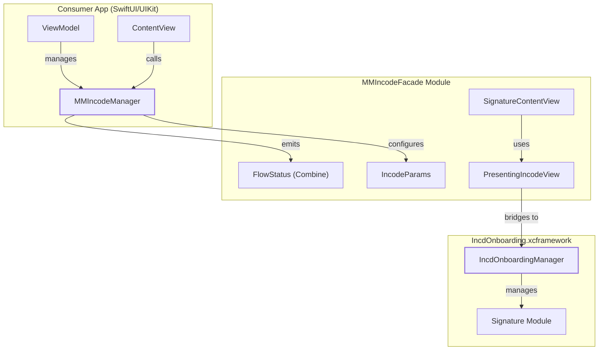
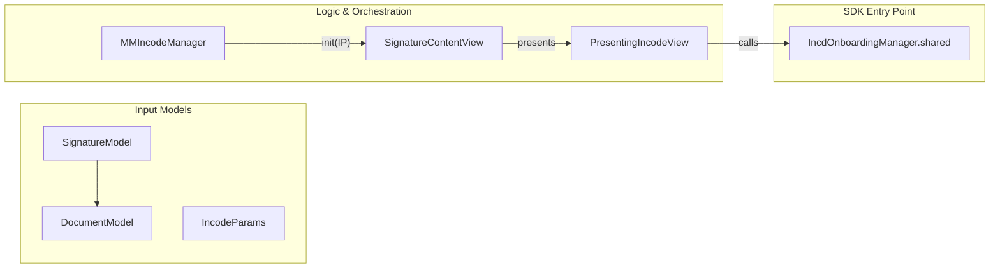

# Overview

# Overview

Relevant source files

The following files were used as context for generating this wiki page:

- [.gitignore](.gitignore)
- [Package.swift](Package.swift)
- [README.md](README.md)

The `MMIncodeFacade` is a Swift-based library designed to simplify the integration of the Incode Onboarding SDK into iOS applications. It acts as a high-level wrapper (Facade) that abstracts the complexities of the underlying `IncdOnboarding.xcframework` [Package.swift:23-26](), providing a streamlined, Combine-powered interface for document signature flows.

The library allows developers to present complex document preview and signature experiences with minimal boilerplate code, handling the bridge between SwiftUI and the SDK's UIKit-based architecture.

## Purpose and Scope

`MMIncodeFacade` exists to provide:
- **Simplified API**: A single entry point through `MMIncodeManager` [README.md:26-30]().
- **SwiftUI Support**: Native-feeling SwiftUI components and view modifiers for presenting the onboarding flow.
- **Event Handling**: A reactive approach to onboarding results using Combine `PassthroughSubject` [README.md:37-41]().
- **Theming**: Easy customization of colors and fonts to match the consumer app's branding.

### System Context Diagram
The following diagram illustrates how the Facade sits between the consumer application and the binary Incode SDK.

**Architecture Bridge: Consumer to SDK**

Sources: [Package.swift:23-30](), [README.md:26-30](), [README.md:81-101]()

---

## Navigating the Wiki

This documentation is organized into sections that cover setup, internal architecture, and SDK management.

### [Getting Started](#1.1)
This section provides a step-by-step guide for integrating the library. It covers:
- Adding the repository via Swift Package Manager (SPM) [README.md:8-12]().
- Setting up the required `IncodeParams` [README.md:26-30]().
- Implementing the `onFinishFlow` subscriber to handle success, failure, and user cancellation [README.md:37-51]().
- For details, see [Getting Started](#1.1).

### [Repository Structure](#1.2)
Explains the physical layout of the codebase, including:
- **Sources/MMIncodeFacade**: The core logic and SwiftUI views.
- **Sources/Frameworks**: The location of the binary `IncdOnboarding.xcframework` [Package.swift:25]().
- **install-frameworks/**: Automation scripts for updating the underlying SDK [README.md:121-128]().
- For details, see [Repository Structure](#1.2).

---

## Core Concepts

### The Facade Pattern
The library uses `MMIncodeManager` as the primary interface. Instead of interacting directly with the `IncdOnboarding` singleton, consumers initialize the manager with their credentials and call `presentSignature(item:)` [README.md:95-97]().

### Data Flow: From Code to UI
The diagram below maps the code entities involved in initiating a signature session.

**Entity Map: Signature Initialization**

Sources: [README.md:26-30](), [README.md:54-74](), [README.md:95-97]()

### Requirements
- **Platform**: iOS 14.0+ [Package.swift:9]().
- **Localization**: Default localization is set to `es-MX` (Spanish - Mexico) [Package.swift:8]().
- **Dependency Manager**: Swift Package Manager [README.md:10]().

---

## Framework Management
Because the Incode SDK is a binary dependency, the repository includes a utility script `install-incode.sh` to manage versions [README.md:121-128](). This ensures that the `IncdOnboarding.xcframework` is correctly placed within the `Sources/Frameworks/` directory for SPM to resolve the `.binaryTarget` [Package.swift:23-26]().

Sources: [Package.swift:23-26](), [README.md:121-128]()

---