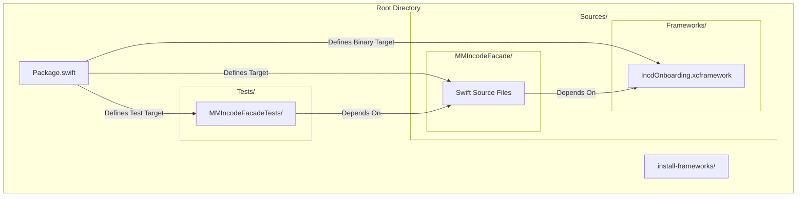
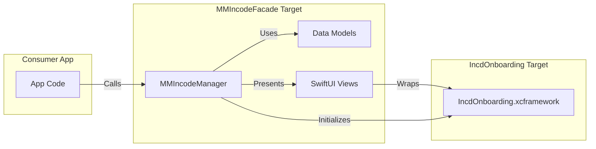

# Repository Structure

# Repository Structure

Relevant source files

The following files were used as context for generating this wiki page:

- [.gitignore](.gitignore)
- [Package.swift](Package.swift)
- [Sources/Frameworks/IncdOnboarding.xcframework/Info.plist](Sources/Frameworks/IncdOnboarding.xcframework/Info.plist)

This page describes the physical and logical layout of the `MMIncodeFacade` repository. The project is organized as a Swift Package Manager (SPM) bundle that encapsulates a third-party binary SDK (`IncdOnboarding.xcframework`) and provides a simplified interface for document signing flows.

## Top-Level Directory Layout

The repository follows standard SPM conventions with additional directories for binary management and testing.

| Directory / File | Description |
| :--- | :--- |
| `Sources/MMIncodeFacade/` | Contains the Swift source code for the facade layer, including the manager, data models, and SwiftUI views. |
| `Sources/Frameworks/` | Host directory for the `IncdOnboarding.xcframework` binary. |
| `Tests/` | Contains unit and integration tests for the facade. |
| `install-frameworks/` | Contains automation scripts for fetching and updating the Incode SDK. |
| `Package.swift` | The manifest file defining the package products, targets, and dependencies. |

### Repository Structure Overview
This diagram illustrates how the file system components relate to the Swift Package targets.

"Repository Structure Map"

Sources: [Package.swift:20-35](), [Sources/Frameworks/IncdOnboarding.xcframework/Info.plist:1-41]()

---

## Core Components

### 1. Facade Source (`Sources/MMIncodeFacade/`)
This is the primary development area. It contains the logic that abstracts the Incode SDK's complexity. The code here is responsible for:
*   **Orchestration**: Managing the lifecycle of the onboarding session via `MMIncodeManager`.
*   **UI/UX**: Providing SwiftUI views like `SignatureContentView` and `PDFKitView` for document previewing.
*   **Theming**: Mapping internal `ThemeColors` to the SDK's `ColorsConfiguration`.

### 2. Binary SDK (`Sources/Frameworks/`)
The `IncdOnboarding.xcframework` is a multi-architecture binary provided by Incode. It is registered as a `.binaryTarget` in the package manifest.

*   **Simulator Support**: Includes an `ios-arm64_x86_64-simulator` slice [Sources/Frameworks/IncdOnboarding.xcframework/Info.plist:9-21]().
*   **Device Support**: Includes an `ios-arm64` slice for physical hardware [Sources/Frameworks/IncdOnboarding.xcframework/Info.plist:24-33]().

### 3. Package Manifest (`Package.swift`)
The manifest coordinates the relationship between the source code and the binary. It specifies a minimum platform version of **iOS 14** [Package.swift:9]().

### Data Flow and Dependency Graph
This diagram shows how the code entities within these directories interact during a build and execution.

"Code Entity Dependency Graph"

Sources: [Package.swift:23-30](), [Sources/Frameworks/IncdOnboarding.xcframework/Info.plist:5-34]()

---

## Infrastructure and Tooling

### Automation (`install-frameworks/`)
The `install-frameworks/` directory (specifically `install-incode.sh`) contains scripts to automate the retrieval of the `IncdOnboarding.xcframework`. This ensures that the large binary files do not necessarily need to be tracked in the primary git history if they can be fetched from a secure source, though they are currently referenced at `Sources/Frameworks/IncdOnboarding.xcframework` [Package.swift:25]().

### Version Control (`.gitignore`)
The project excludes standard Swift/Xcode artifacts to maintain a clean repository:
*   `.build` and `Packages`: Prevents checking in local SPM artifacts [.gitignore:2-3]().
*   `DerivedData` and `xcuserdata`: Excludes local IDE state [.gitignore:5-6]().
*   `.swiftpm`: Excludes local package configuration [.gitignore:7-7]().

### Testing (`Tests/`)
The `MMIncodeFacadeTests` target is located in `Tests/MMIncodeFacadeTests/`. It depends on the `MMIncodeFacade` target, allowing for integration testing of the manager and models [Package.swift:31-34]().

Sources: [.gitignore:1-8](), [Package.swift:31-34]()

---