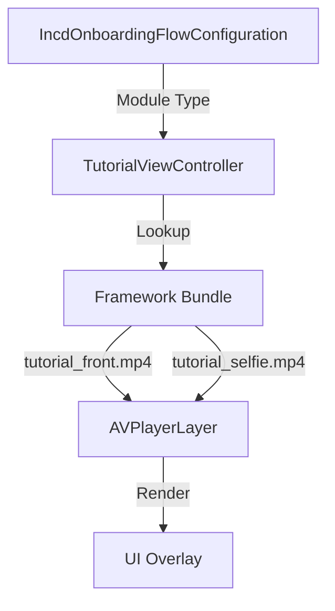
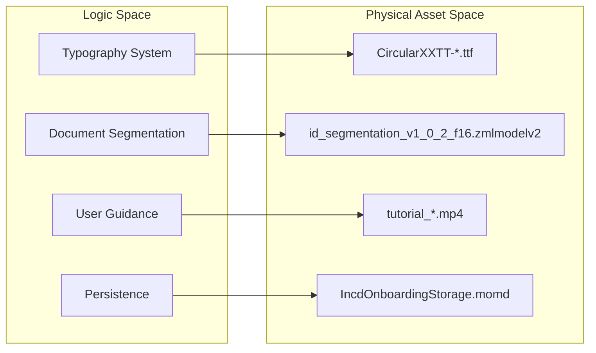

# SDK Resources & Assets

# SDK Resources & Assets

Relevant source files

The following files were used as context for generating this wiki page:

- [Sources/Frameworks/IncdOnboarding.xcframework/ios-arm64/IncdOnboarding.framework/Assets.car](Sources/Frameworks/IncdOnboarding.xcframework/ios-arm64/IncdOnboarding.framework/Assets.car)
- [Sources/Frameworks/IncdOnboarding.xcframework/ios-arm64/IncdOnboarding.framework/CircularXXTT-Black.ttf](Sources/Frameworks/IncdOnboarding.xcframework/ios-arm64/IncdOnboarding.framework/CircularXXTT-Black.ttf)
- [Sources/Frameworks/IncdOnboarding.xcframework/ios-arm64/IncdOnboarding.framework/CircularXXTT-Bold.ttf](Sources/Frameworks/IncdOnboarding.xcframework/ios-arm64/IncdOnboarding.framework/CircularXXTT-Bold.ttf)
- [Sources/Frameworks/IncdOnboarding.xcframework/ios-arm64/IncdOnboarding.framework/CircularXXTT-Book.ttf](Sources/Frameworks/IncdOnboarding.xcframework/ios-arm64/IncdOnboarding.framework/CircularXXTT-Book.ttf)
- [Sources/Frameworks/IncdOnboarding.xcframework/ios-arm64/IncdOnboarding.framework/CircularXXTT-Medium.ttf](Sources/Frameworks/IncdOnboarding.xcframework/ios-arm64/IncdOnboarding.framework/CircularXXTT-Medium.ttf)

This page documents the non-code resources and binary assets bundled within the `IncdOnboarding.framework`. These assets are critical for the UI/UX of the onboarding flow, providing the visual elements, typography, instructional media, and machine learning capabilities required for identity verification.

## Resource Bundle Overview

The `IncdOnboarding.framework` acts as a self-contained resource provider. When the facade initializes the SDK via `IncdOnboardingManager`, these resources are loaded from the framework's internal bundle.

### Visual Assets (`Assets.car`)
The `Assets.car` file is a compiled Asset Catalog containing all UI icons, overlays, and button states used by the SDK's internal ViewControllers.
*   **Implementation**: Accessed internally by the SDK using `UIImage(named:in:compatibleWith:)` pointing to the framework bundle.
*   **Contents**: Scanning reticles for ID capture, success/error icons, and module-specific graphics (e.g., credit card or document icons).

### Typography: CircularXXTT Font Family
The SDK utilizes the CircularXXTT font family for its interface to maintain brand consistency across modules.
*   **Files**:
    *   `CircularXXTT-Black.ttf`
    *   `CircularXXTT-Bold.ttf`
    *   `CircularXXTT-Book.ttf`
    *   `CircularXXTT-Medium.ttf`
*   **Usage**: These fonts are registered dynamically at runtime by the SDK. The facade can influence their appearance through the `ThemeColors` and `DefaultMMTheme` configurations.

Sources: [Sources/Frameworks/IncdOnboarding.xcframework/ios-arm64/IncdOnboarding.framework/Assets.car:1-4](), [Sources/Frameworks/IncdOnboarding.xcframework/ios-arm64/IncdOnboarding.framework/CircularXXTT-Black.ttf:1-5](), [Sources/Frameworks/IncdOnboarding.xcframework/ios-arm64/IncdOnboarding.framework/CircularXXTT-Bold.ttf:1-5](), [Sources/Frameworks/IncdOnboarding.xcframework/ios-arm64/IncdOnboarding.framework/CircularXXTT-Book.ttf:1-5](), [Sources/Frameworks/IncdOnboarding.xcframework/ios-arm64/IncdOnboarding.framework/CircularXXTT-Medium.ttf:1-5]()

---

## Instructional Media (Tutorial Videos)

The SDK includes several `.mp4` files used to provide real-time instructional overlays to users during the onboarding process. These videos are displayed in the `IdTutorials` module.

| File Name | Context / Module |
| :--- | :--- |
| `tutorial_front.mp4` | Instructions for capturing the front of an ID card. |
| `tutorial_back.mp4` | Instructions for capturing the back of an ID card. |
| `tutorial_passport.mp4` | Instructions for passport-specific scanning. |
| `tutorial_selfie.mp4` | Instructions for standard selfie capture. |
| `tutorial_videoSelfie.mp4` | Instructions for the liveness/video selfie module. |
| `tutorial_qr.mp4` | Instructions for QR code scanning. |
| `id-processing.mp4` | Loop video shown during background server-side validation. |

### Data Flow: Media Playback
The following diagram illustrates how the SDK's tutorial module selects and plays these assets based on the flow configuration.

**Tutorial Asset Resolution**

Sources: [Sources/Frameworks/IncdOnboarding.xcframework/ios-arm64/IncdOnboarding.framework/IncdOnboarding-Swift.h:1-10]() (Internal SDK reference)

---

## Data Models & Intelligence

### Core Data Storage (`IncdOnboardingStorage.momd`)
The SDK maintains a local persistence layer using Core Data.
*   **Entity**: `IncdOnboardingStorage.momd`
*   **Purpose**: Temporarily caches session metadata, draft onboarding states, and local logs before they are synchronized with the Incode servers.
*   **Location**: Found within the framework root.

### Machine Learning Model (`id_segmentation_v1_0_2_f16.zmlmodelv2`)
The SDK performs on-device edge computing to detect and segment ID documents in the camera feed.
*   **Model**: `id_segmentation_v1_0_2_f16.zmlmodelv2`
*   **Function**: Used by the `IDCapture` module to provide real-time feedback (e.g., "Move Closer", "Keep Steady") and to perform the actual cropping of the document image before upload.

### Metadata (`PhoneNumberMetadata.json`)
A utility resource used by the `OTPVerification` and phone input modules to validate international phone number formats and provide correct country code prefixes.

Sources: [Sources/Frameworks/IncdOnboarding.xcframework/ios-arm64/IncdOnboarding.framework/IncdOnboarding-Swift.h:1-10]() (Internal SDK reference)

---

## Localization Bundles

The SDK supports multi-language interfaces through standard iOS `.lproj` bundles.

*   **Supported Locales**:
    *   `en.lproj` (English - Default)
    *   `es.lproj` (Spanish)
    *   `pt.lproj` (Portuguese)
*   **Logic**: The SDK automatically selects the bundle matching the user's device settings. However, the `MMIncodeFacade` can influence text by passing specific strings through the `IncodeParams` if the underlying SDK allows for runtime overrides.

### Resource Mapping: Code to Entity

The following diagram maps the logical system requirements to the physical files bundled in the framework.

**Asset to Module Mapping**

Sources: [Sources/Frameworks/IncdOnboarding.xcframework/ios-arm64/IncdOnboarding.framework/CircularXXTT-Bold.ttf:1-5](), [Sources/Frameworks/IncdOnboarding.xcframework/ios-arm64/IncdOnboarding.framework/Assets.car:1-4]()

---