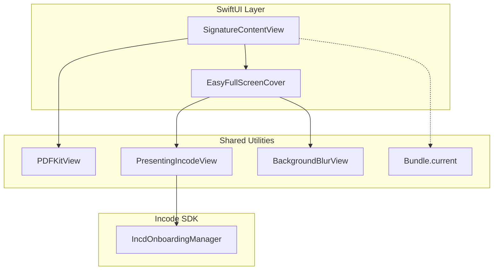

# Shared Utilities

# Shared Utilities

Relevant source files

The following files were used as context for generating this wiki page:

- [README.md](README.md)

The `Shared` directory in `MMIncodeFacade` contains reusable components, extensions, and UI bridges that support the signature flow and provide a foundation for future onboarding modules. These utilities abstract complex UIKit behaviors into SwiftUI-friendly interfaces and provide global helper methods for theme and asset management.

### Architecture Overview

The shared utilities act as a bridge between the core business logic and the UI layer. They are designed to be modular, ensuring that common tasks—such as rendering PDFs or converting colors—are handled consistently across the facade.

**Utility Mapping: Natural Language to Code Entities**

| Concept | Code Entity | Purpose |
| :--- | :--- | :--- |
| **PDF Rendering** | `PDFKitView` | Asynchronous loading and display of documents. |
| **Modal Presentation** | `EasyFullScreenCover` | Custom overlay management for the Incode SDK. |
| **SDK Bridge** | `PresentingIncodeView` | Bridge for `IncdOnboardingManager` presentation. |
| **Theme Helper** | `Color.toUIColor` | Mapping SwiftUI styles to Incode SDK requirements. |
| **Asset Access** | `Bundle.current` | Resolving resources within the Swift Package. |

### Component Relationships

The following diagram illustrates how shared utilities facilitate the interaction between the `SignatureContentView` and the underlying `IncdOnboarding` SDK.

**Shared Utility Integration Flow**

Sources: [Sources/MMIncodeFacade/Shared/Views/PDFKitView.swift:1-10](), [Sources/MMIncodeFacade/Shared/Views/EasyFullScreenCover.swift:1-15](), [Sources/MMIncodeFacade/Shared/Views/PresentingIncodeView.swift:1-12]()

---

### [Shared Views](#4.1)

The facade includes several specialized views to handle the unique requirements of the Incode SDK integration:

*   **PDFKitView**: A `UIViewRepresentable` wrapper around `PDFView` that handles asynchronous document loading from the `urlString` provided in `DocumentModel`.
*   **BackgroundBlurView**: Wraps `UIVisualEffectView` to provide a standard system blur effect, typically used as a backdrop for modal overlays.
*   **EasyFullScreenCover**: A custom implementation of a full-screen overlay that provides more granular control over presentation and dismissal than the standard SwiftUI `.fullScreenCover`, utilizing an environment-based dismiss action.
*   **PresentingIncodeView**: A critical bridge component that provides the `UIViewController` required by `IncdOnboardingManager.shared.presentingViewController` to launch the SDK's native UI modules.

For details, see [Shared Views](#4.1).

Sources: [Sources/MMIncodeFacade/Shared/Views/PDFKitView.swift:7-20](), [Sources/MMIncodeFacade/Shared/Views/PresentingIncodeView.swift:8-15](), [Sources/MMIncodeFacade/Shared/Views/EasyFullScreenCover.swift:10-30]()

---

### [Extensions & Helpers](#4.2)

Utility extensions simplify the interaction between the facade's modern SwiftUI API and the legacy UIKit requirements of the Incode SDK:

*   **Color.toUIColor**: An extension on `Color` that converts SwiftUI color definitions into `UIColor` instances. This is primarily used by the `ThemeColors` struct to pass user-defined themes into the SDK's `ColorsConfiguration`.
*   **View.easyFullScreenCover**: A convenience modifier that allows developers to apply the `EasyFullScreenCover` logic directly to any SwiftUI view hierarchy.
*   **Bundle.current**: A static helper that ensures the facade correctly identifies its own bundle during resource lookup (such as localizations or images), which is essential when the library is consumed via Swift Package Manager.

For details, see [Extensions & Helpers](#4.2).

Sources: [Sources/MMIncodeFacade/Shared/Extensions/Color+Extension.swift:5-15](), [Sources/MMIncodeFacade/Shared/Extensions/View+Extension.swift:10-20](), [Sources/MMIncodeFacade/Shared/Extensions/Bundle+Extension.swift:5-12]()

---