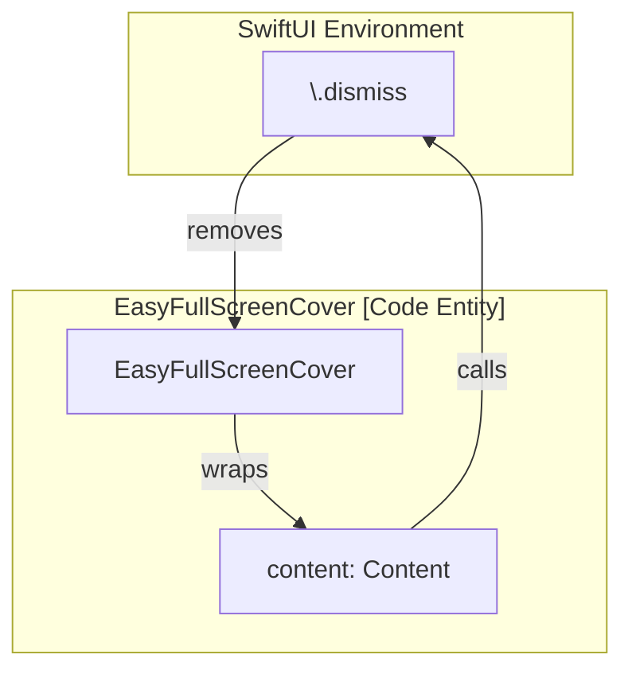

# Shared Views

# Shared Views

Relevant source files

The following files were used as context for generating this wiki page:

- [README.md](README.md)
- [Sources/Frameworks/IncdOnboarding.xcframework/ios-arm64/IncdOnboarding.framework/Antifraud.storyboardc/Y6W-OH-hqX-view-5EZ-qb-Rvc.nib](Sources/Frameworks/IncdOnboarding.xcframework/ios-arm64/IncdOnboarding.framework/Antifraud.storyboardc/Y6W-OH-hqX-view-5EZ-qb-Rvc.nib)

This page documents the reusable SwiftUI and UIKit components within the `MMIncodeFacade` library. These views provide foundational UI capabilities such as PDF rendering, visual effects, and the critical bridge between SwiftUI and the Incode SDK's `UIViewController`-based architecture.

## PDFKitView

The `PDFKitView` is a SwiftUI wrapper around the `PDFView` class from Apple's PDFKit framework. It is used to asynchronously load and display PDF documents within the signature flow.

### Implementation Details
- **Type**: `UIViewRepresentable` [Sources/MMIncodeFacade/Shared/Views/PDFKitView.swift:8-8]()
- **Data Flow**: It accepts a `URL` which is used to initialize a `PDFDocument`.
- **Configuration**:
    - `autoScales`: Set to `true` to ensure the document fits the available screen width [Sources/MMIncodeFacade/Shared/Views/PDFKitView.swift:23-23]().
    - `displayMode`: Configured to `.singlePageContinuous` for a smooth scrolling experience [Sources/MMIncodeFacade/Shared/Views/PDFKitView.swift:24-24]().
    - `displayDirection`: Set to `.vertical` [Sources/MMIncodeFacade/Shared/Views/PDFKitView.swift:25-25]().

### Component Structure
| Method | Responsibility |
| :--- | :--- |
| `makeUIView(context:)` | Instantiates the `PDFView` and configures its display properties [Sources/MMIncodeFacade/Shared/Views/PDFKitView.swift:15-28](). |
| `updateUIView(_:context:)` | Handles updates to the view, though the current implementation relies on the initial setup [Sources/MMIncodeFacade/Shared/Views/PDFKitView.swift:30-30](). |

**Sources:** [Sources/MMIncodeFacade/Shared/Views/PDFKitView.swift:1-32]()

---

## BackgroundBlurView

The `BackgroundBlurView` provides a native Gaussian blur effect by wrapping `UIVisualEffectView`. It is primarily used as a backdrop for modal overlays to maintain visual hierarchy.

### Implementation Details
- **Type**: `UIViewRepresentable` [Sources/MMIncodeFacade/Shared/Views/BackgroundBlurView.swift:8-8]()
- **Effect**: Uses `UIBlurEffect(style: .systemUltraThinMaterial)` to adapt to light and dark mode automatically [Sources/MMIncodeFacade/Shared/Views/BackgroundBlurView.swift:11-11]().

**Sources:** [Sources/MMIncodeFacade/Shared/Views/BackgroundBlurView.swift:1-19]()

---

## EasyFullScreenCover

`EasyFullScreenCover` is a custom container view used to present full-screen content (like the Incode SDK UI) with a specialized dismissal mechanism that interacts with the SwiftUI Environment.

### Implementation Details
- **Dismissal**: Utilizes `@Environment(\.dismiss)` to allow the presented content to trigger its own removal from the view stack [Sources/MMIncodeFacade/Shared/Views/EasyFullScreenCover.swift:11-11]().
- **Layout**: Uses a `ZStack` to layer the `BackgroundBlurView` behind the provided `content` [Sources/MMIncodeFacade/Shared/Views/EasyFullScreenCover.swift:17-21]().

### Data Flow Diagram: Presentation and Dismissal
This diagram shows how `EasyFullScreenCover` bridges the environment dismiss action to the UI.

Title: EasyFullScreenCover Environment Interaction

**Sources:** [Sources/MMIncodeFacade/Shared/Views/EasyFullScreenCover.swift:8-25]()

---

## PresentingIncodeView

`PresentingIncodeView` is the most critical bridge component in the facade. It allows the `IncdOnboardingManager` (which requires a `UIViewController` to host its UI) to function within a SwiftUI-based view hierarchy.

### Implementation Details
- **Type**: `UIViewControllerRepresentable` [Sources/MMIncodeFacade/Shared/Views/PresentingIncodeView.swift:9-9]()
- **Core Logic**:
    - It creates an empty `UIViewController` instance [Sources/MMIncodeFacade/Shared/Views/PresentingIncodeView.swift:13-15]().
    - In `updateUIViewController`, it assigns this newly created controller to `IncdOnboardingManager.shared.presentingViewController` [Sources/MMIncodeFacade/Shared/Views/PresentingIncodeView.swift:19-19]().
    - This assignment provides the SDK with the necessary context to call `present(_:animated:completion:)` internally.

### Entity Mapping: SwiftUI to Incode SDK Bridge
This diagram maps the internal Facade view to the external SDK requirements.

Title: PresentingIncodeView Bridge Mapping

**Sources:** [Sources/MMIncodeFacade/Shared/Views/PresentingIncodeView.swift:1-22]()

---

## Summary of Shared Components

| Component | File Path | Primary Dependency |
| :--- | :--- | :--- |
| `PDFKitView` | `Shared/Views/PDFKitView.swift` | `PDFKit` |
| `BackgroundBlurView` | `Shared/Views/BackgroundBlurView.swift` | `UIKit (UIVisualEffectView)` |
| `EasyFullScreenCover` | `Shared/Views/EasyFullScreenCover.swift` | `SwiftUI Environment` |
| `PresentingIncodeView` | `Shared/Views/PresentingIncodeView.swift` | `IncdOnboarding SDK` |

**Sources:** [Sources/MMIncodeFacade/Shared/Views/PDFKitView.swift:1-32](), [Sources/MMIncodeFacade/Shared/Views/BackgroundBlurView.swift:1-19](), [Sources/MMIncodeFacade/Shared/Views/EasyFullScreenCover.swift:1-25](), [Sources/MMIncodeFacade/Shared/Views/PresentingIncodeView.swift:1-22]()

---