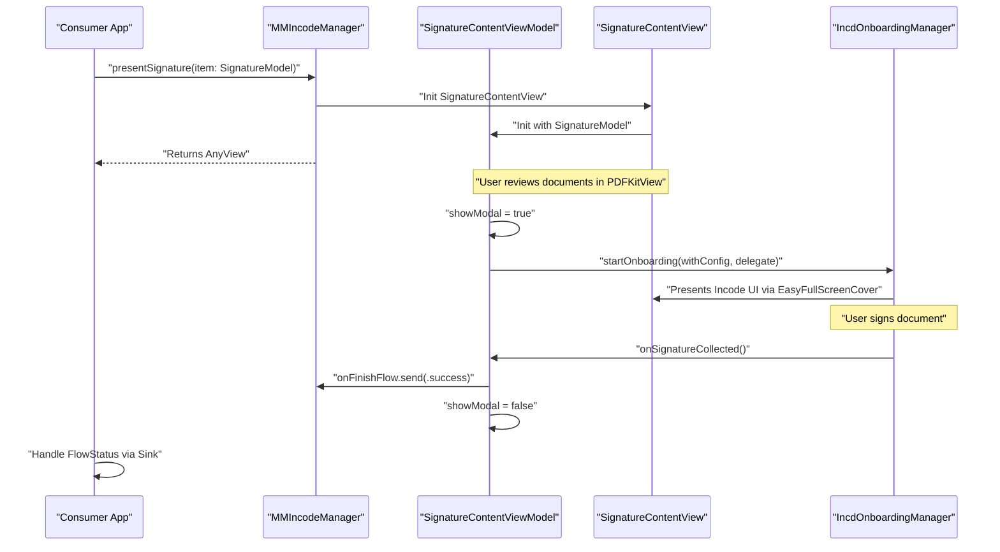
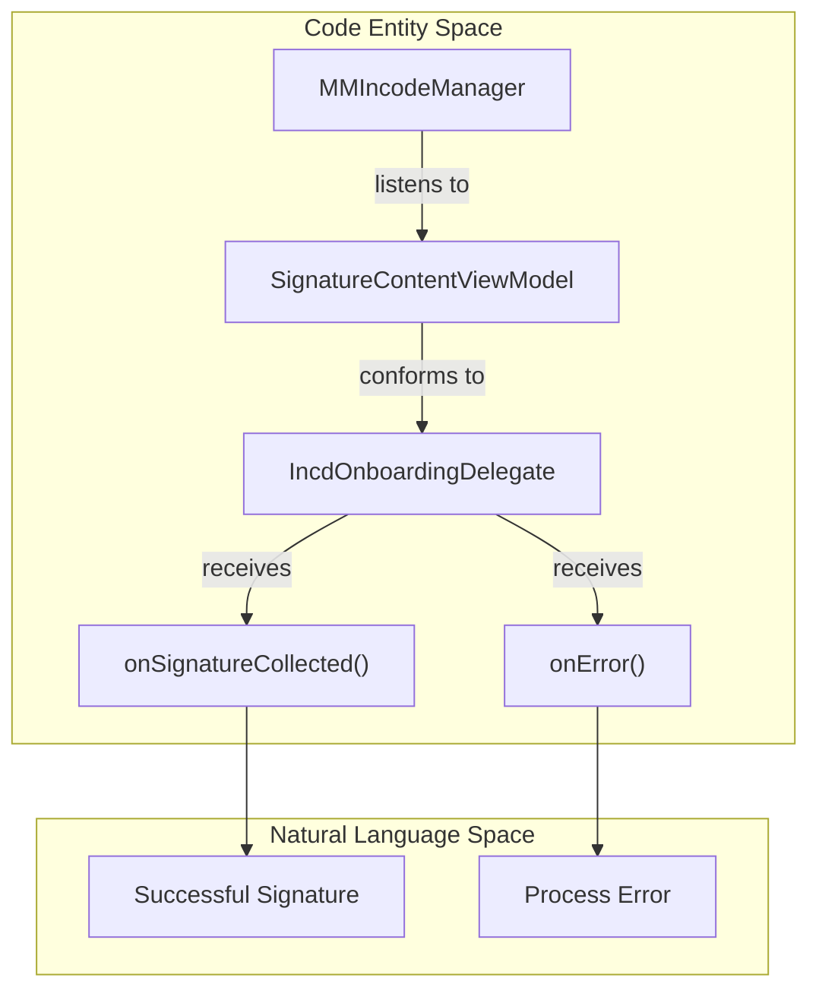

# Signature Flow

# Signature Flow

Relevant source files

The following files were used as context for generating this wiki page:

- [README.md](README.md)

The signature flow is the primary user journey provided by the `MMIncodeFacade` library. It orchestrates a multi-step process that begins with document previewing and culminates in a secure digital signature captured via the Incode SDK. This flow is designed to be self-contained, handling its own navigation, error states, and SDK lifecycle management.

### Workflow Overview

The flow is initiated by a consumer application calling `presentSignature(item:)` on the `MMIncodeManager`. This triggers a SwiftUI-based interface that guides the user through the following high-level states:

1.  **Document Review**: The user is presented with a list of PDF documents to review.
2.  **Consent & Navigation**: The user navigates through the documents using a specialized footer interface.
3.  **SDK Handover**: Upon reaching the final document and agreeing to sign, the facade hands control to the Incode SDK.
4.  **Signature Capture**: The Incode SDK provides the canvas for capturing the biometric signature.
5.  **Completion & Feedback**: The flow dismisses itself and publishes a `FlowStatus` result (success, cancel, or error) back to the caller.

### Sequence Diagram: Signature Workflow

The following diagram illustrates the interaction between the consumer app, the Facade's internal components, and the underlying Incode SDK.

**Sources:**
*   [Sources/MMIncodeFacade/MMIncodeManager.swift:49-53]() (Method `presentSignature`)
*   [Sources/MMIncodeFacade/MMIncodeManager.swift:15-17]() (Definition of `onFinishFlow`)
*   [Sources/MMIncodeFacade/Signature/SignatureContentView.swift:13-20]() (View structure)
*   [Sources/MMIncodeFacade/Signature/SignatureContentViewModel.swift:49-55]() (Onboarding trigger)

### Core Components

The signature flow is divided into three distinct layers, each covered in detail in the child pages of this section:

#### 1. The View Layer
The UI is built using SwiftUI and centers around the `SignatureContentView`. It manages a stack of `DocumentPreview` components and uses a custom `FooterDocumentPreview` to handle navigation logic between multiple PDFs. It utilizes `PDFKitView` for high-performance document rendering.
*   For details, see [Signature Views](#3.1).

#### 2. The Logic Layer
State management and SDK delegation are handled by the `SignatureContentViewModel`. This class acts as the `IncdOnboardingDelegate`, translating low-level SDK callbacks (like `userCancelledSession` or `onError`) into the high-level `FlowStatus` enum used by the facade. It also manages UI-specific states like error alerts and modal visibility.
*   For details, see [Signature View Model & Delegate](#3.2).

#### 3. The SDK Integration Layer
The bridge between the Facade and the binary `IncdOnboarding.xcframework` is managed via the `MMSignature` class and `PresentingIncodeView`. This layer configures the specific Incode "Signature" module and ensures the SDK has a valid `UIViewController` to present its native interface over the SwiftUI environment.
*   For details, see [MMSignature & SDK Integration](#3.3).

### Data Flow & Result Handling

The flow terminates by emitting a `FlowStatus` through a `PassthroughSubject`. Consumer applications should subscribe to this subject to react to the flow's conclusion.

| Status Case | Trigger | Data Returned |
| :--- | :--- | :--- |
| `.success` | `onSignatureCollected` called by SDK | `[DocumentModel]` |
| `.userFinish` | `userCancelledSession` called by SDK | None |
| `.error` | `onError` called by SDK or network failure | `String` (Error Message) |

**Sources:**
*   [Sources/MMIncodeFacade/Models/FlowStatus.swift:8-13]() (Enum definition)
*   [Sources/MMIncodeFacade/Signature/SignatureContentViewModel.swift:78-95]() (Delegate implementation)
*   [README.md:37-52]() (Example implementation of result handling)

---