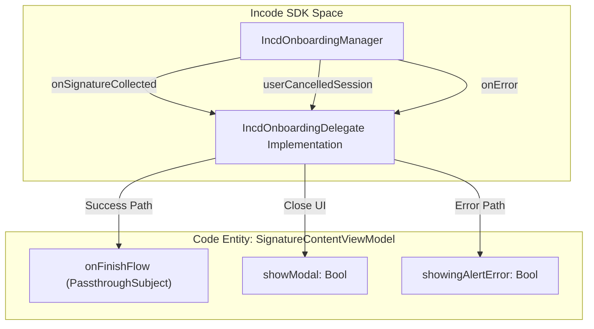
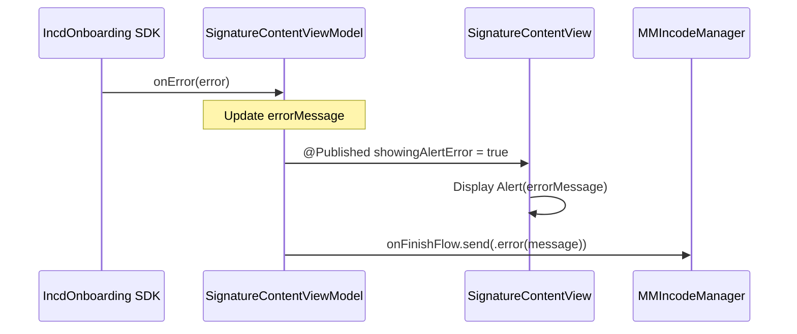

# Signature View Model & Delegate

# Signature View Model & Delegate

Relevant source files

The following files were used as context for generating this wiki page:

- [README.md](README.md)

The signature flow in `MMIncodeFacade` is driven by the `SignatureContentViewModel`. This class acts as the central state manager for the signature UI and serves as the bridge between the **Incode SDK** events and the **MMIncodeFacade** result propagation. It implements the `IncdOnboardingDelegate` to capture lifecycle events from the underlying framework and translate them into actionable states or final results for the consumer.

## SignatureContentViewModel Overview

The `SignatureContentViewModel` is an `ObservableObject` that manages the visibility of the signature modal, handles error states, and maintains the list of documents to be signed.

### Key State Properties
- `showModal`: A `Published` Boolean that controls the presentation of the `EasyFullScreenCover` containing the Incode SDK UI [Sources/MMIncodeFacade/SignatureFlow/SignatureContentViewModel.swift:15-15]().
- `showingAlertError`: A `Published` Boolean used to trigger SwiftUI alerts when an error occurs during the SDK session [Sources/MMIncodeFacade/SignatureFlow/SignatureContentViewModel.swift:16-16]().
- `errorMessage`: Stores the specific error string to be displayed in the alert [Sources/MMIncodeFacade/SignatureFlow/SignatureContentViewModel.swift:17-17]().
- `item`: A `SignatureModel` containing the document metadata and URLs [Sources/MMIncodeFacade/SignatureFlow/SignatureContentViewModel.swift:13-13]().

### Data Flow: View Model to Manager
The View Model holds a reference to the `MMIncodeManager.onFinishFlow` subject. When the signature process reaches a terminal state (success, cancellation, or error), the View Model emits a `FlowStatus` value through this subject [Sources/MMIncodeFacade/SignatureFlow/SignatureContentViewModel.swift:12-12]().

Sources: [Sources/MMIncodeFacade/SignatureFlow/SignatureContentViewModel.swift:10-25]()

## IncdOnboardingDelegate Conformance

The View Model implements `IncdOnboardingDelegate` to receive callbacks from the Incode SDK. These methods are critical for mapping SDK-specific events to the facade's internal logic.

| Method | Description | Action Taken |
| :--- | :--- | :--- |
| `onSignatureCollected(_:)` | Called when the user successfully completes the signature module. | Emits `.success` with the signed documents and sets `showModal = false` [Sources/MMIncodeFacade/SignatureFlow/SignatureContentViewModel.swift:33-37](). |
| `onError(_:)` | Triggered when the SDK encounters a functional or network error. | Sets `errorMessage`, triggers `showingAlertError = true`, and emits `.error` [Sources/MMIncodeFacade/SignatureFlow/SignatureContentViewModel.swift:45-49](). |
| `userCancelledSession()` | Triggered when the user manually exits the Incode flow. | Emits `.userFinish` and sets `showModal = false` [Sources/MMIncodeFacade/SignatureFlow/SignatureContentViewModel.swift:39-43](). |

### Code-to-Entity Mapping: Delegate Flow
This diagram illustrates how the `SignatureContentViewModel` (Code Entity) handles "Natural Language" events from the SDK.

**Signature Event Handling**

Sources: [Sources/MMIncodeFacade/SignatureFlow/SignatureContentViewModel.swift:31-56]()

## Error Handling and Alerting

Errors originating from the Incode SDK are surfaced to the user via a standard SwiftUI alert. The `SignatureContentViewModel` manages this lifecycle:

1.  **Capture**: The `onError(_:)` delegate method receives an `IncdOnboardingError` [Sources/MMIncodeFacade/SignatureFlow/SignatureContentViewModel.swift:45-45]().
2.  **State Update**: The error message is extracted, and `showingAlertError` is set to `true` [Sources/MMIncodeFacade/SignatureFlow/SignatureContentViewModel.swift:47-48]().
3.  **UI Feedback**: `SignatureContentView` observes `showingAlertError` and presents an alert with the message [Sources/MMIncodeFacade/SignatureFlow/SignatureContentView.swift:54-58]().
4.  **Reporting**: The error is simultaneously sent back to the `MMIncodeManager` via the `.error(String)` enum case [Sources/MMIncodeFacade/SignatureFlow/SignatureContentViewModel.swift:46-46]().

### Data Flow Diagram: Error Propagation
This diagram traces an error from the SDK through the View Model to the UI and the Manager.

**Error Propagation Flow**

Sources: [Sources/MMIncodeFacade/SignatureFlow/SignatureContentViewModel.swift:45-50](), [Sources/MMIncodeFacade/SignatureFlow/SignatureContentView.swift:54-58]()

## Implementation Details

### Initialization
The View Model is initialized with the `SignatureModel` and the result subject from `MMIncodeManager`. This ensures that every signature session has a direct pipeline to return results to the caller [Sources/MMIncodeFacade/SignatureFlow/SignatureContentViewModel.swift:19-24]().

### Flow Termination
When `userCancelledSession()` or `onSignatureCollected(_:)` is called, the View Model explicitly sets `showModal = false`. This triggers the dismissal of the `EasyFullScreenCover` in the view layer, returning the user to the document preview or the host application [Sources/MMIncodeFacade/SignatureFlow/SignatureContentViewModel.swift:36-42]().

Sources: [Sources/MMIncodeFacade/SignatureFlow/SignatureContentViewModel.swift:1-56]()

---