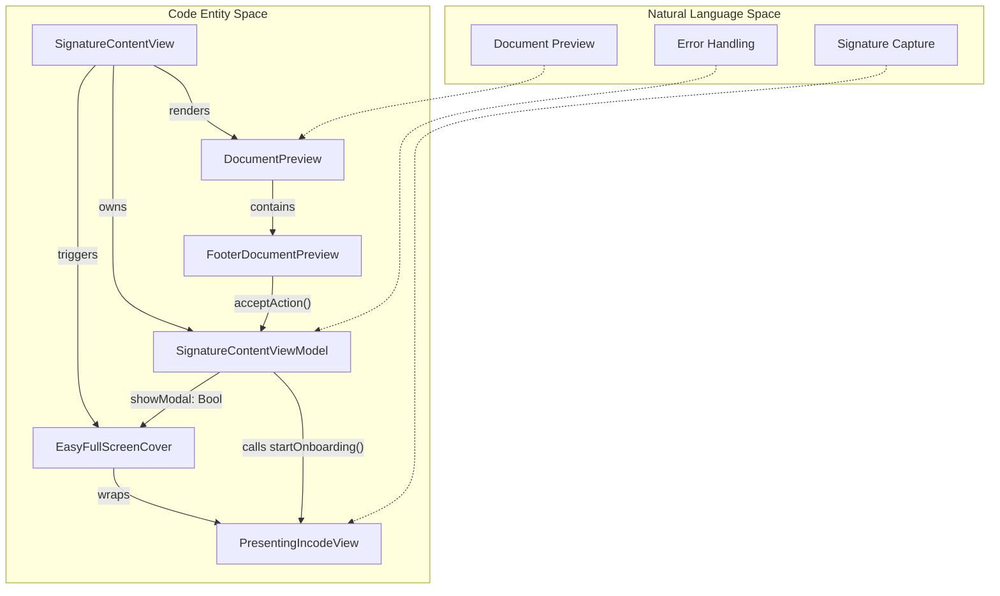
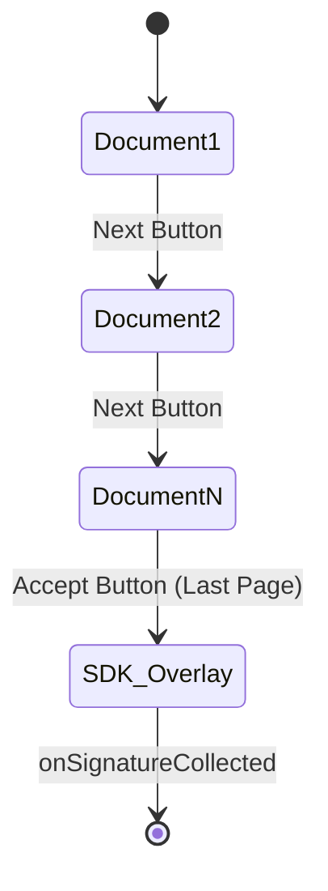

# Signature Views

# Signature Views

Relevant source files

The following files were used as context for generating this wiki page:

- [README.md](README.md)
- [Sources/Frameworks/IncdOnboarding.xcframework/ios-arm64/IncdOnboarding.framework/Antifraud.storyboardc/Y6W-OH-hqX-view-5EZ-qb-Rvc.nib](Sources/Frameworks/IncdOnboarding.xcframework/ios-arm64/IncdOnboarding.framework/Antifraud.storyboardc/Y6W-OH-hqX-view-5EZ-qb-Rvc.nib)

The **Signature Views** layer constitutes the user interface of the `MMIncodeFacade`. It provides a seamless transition between the consumer application, a PDF document previewer, and the Incode SDK's biometric signature capture interface. The architecture follows a container-based approach where the document preview acts as the primary context, and the SDK UI is presented as an overlay.

## View Hierarchy and Data Flow

The signature flow is orchestrated through a hierarchical SwiftUI structure. The `SignatureContentView` serves as the root container, managing the state of the document preview and the presentation of the Incode SDK.

### Structural Overview
- **`SignatureContentView`**: The top-level container that holds the business logic via `SignatureContentViewModel`.
- **`DocumentPreview`**: A paginated viewer that allows users to review documents before signing.
- **`FooterDocumentPreview`**: A contextual footer that toggles between "Next" (pagination) and "Accept" (triggering the SDK).
- **`EasyFullScreenCover`**: A custom presentation modifier that injects the Incode SDK's `UIViewController` over the current SwiftUI hierarchy.

### Component Relationship Diagram
The following diagram illustrates how natural language concepts (Preview, Sign, Error) map to specific code entities and how data flows between them.

**Entity Mapping and Data Flow**

Sources: [Sources/MMIncodeFacade/Signature/SignatureContentView.swift:11-50](), [Sources/MMIncodeFacade/Signature/DocumentPreview.swift:10-40](), [Sources/MMIncodeFacade/Shared/Views/EasyFullScreenCover.swift:10-30]()

---

## SignatureContentView
`SignatureContentView` is the entry point for the signature module. It initializes the `SignatureContentViewModel` and sets up the layout for the document review process.

- **Implementation**: It uses a `ZStack` to layer the `DocumentPreview` and handles the conditional presentation of the Incode SDK via the `.easyFullScreenCover` modifier.
- **State Management**: It observes `viewModel.showModal`. When the user clicks "Accept" in the footer, this boolean is toggled, causing the `EasyFullScreenCover` to present the `PresentingIncodeView`.

Sources: [Sources/MMIncodeFacade/Signature/SignatureContentView.swift:11-50]()

---

## Document Preview & Navigation
The preview system ensures that users have reviewed all necessary documents before the signature module becomes accessible.

### DocumentPreview
This view manages the `TabView` with a `PageTabViewStyle`, allowing horizontal swiping through the `DocumentModel` array. It tracks the `currentIndex` to determine if the user has reached the final document.

### FooterDocumentPreview
The footer provides the primary interaction point for the flow.
- **Next Button**: Increments the `currentIndex` in the `DocumentPreview`.
- **Accept Button**: Only appears on the last page of the document set. When tapped, it executes the `acceptAction` closure, which sets `viewModel.showModal = true`.

**Navigation Logic Flow**

Sources: [Sources/MMIncodeFacade/Signature/DocumentPreview.swift:10-60](), [Sources/MMIncodeFacade/Signature/FooterDocumentPreview.swift:10-55]()

---

## Incode SDK Presentation
The integration of the Incode SDK UI into the SwiftUI hierarchy is handled by two specialized components: `EasyFullScreenCover` and `PresentingIncodeView`.

### EasyFullScreenCover
Since the Incode SDK is built on UIKit and requires a specific `UIViewController` context for presentation, `EasyFullScreenCover` provides a bridge. It uses a custom `ViewModifier` to present a `BackgroundBlurView` and the SDK content over the current view, bypassing standard SwiftUI `fullScreenCover` limitations when dealing with complex SDK lifecycles.

### PresentingIncodeView
This is a `UIViewControllerRepresentable` that serves as the "anchor" for the Incode SDK.
1. It creates a standard `UIViewController`.
2. It passes this controller to `IncdOnboardingManager.shared.presentingViewController`.
3. It calls `viewModel.startOnboarding()`, which instructs the Incode SDK to begin the signature capture flow using the provided view controller as the presenting parent.

**Presentation Architecture**
| Component | Responsibility |
| :--- | :--- |
| `SignatureContentViewModel` | Coordinates the `MMSignature` configuration and handles SDK delegate callbacks. |
| `EasyFullScreenCover` | Manages the visual transition and provides the `dismiss` environment action. |
| `PresentingIncodeView` | Bridges SwiftUI to the UIKit `presentingViewController` required by Incode. |
| `PDFKitView` | Used within `DocumentPreview` to render the actual PDF content from `urlString`. |

Sources: [Sources/MMIncodeFacade/Shared/Views/EasyFullScreenCover.swift:10-80](), [Sources/MMIncodeFacade/Shared/Views/PresentingIncodeView.swift:10-30](), [Sources/MMIncodeFacade/Shared/Views/PDFKitView.swift:10-35](), [Sources/MMIncodeFacade/Signature/SignatureContentViewModel.swift:10-40]()

---