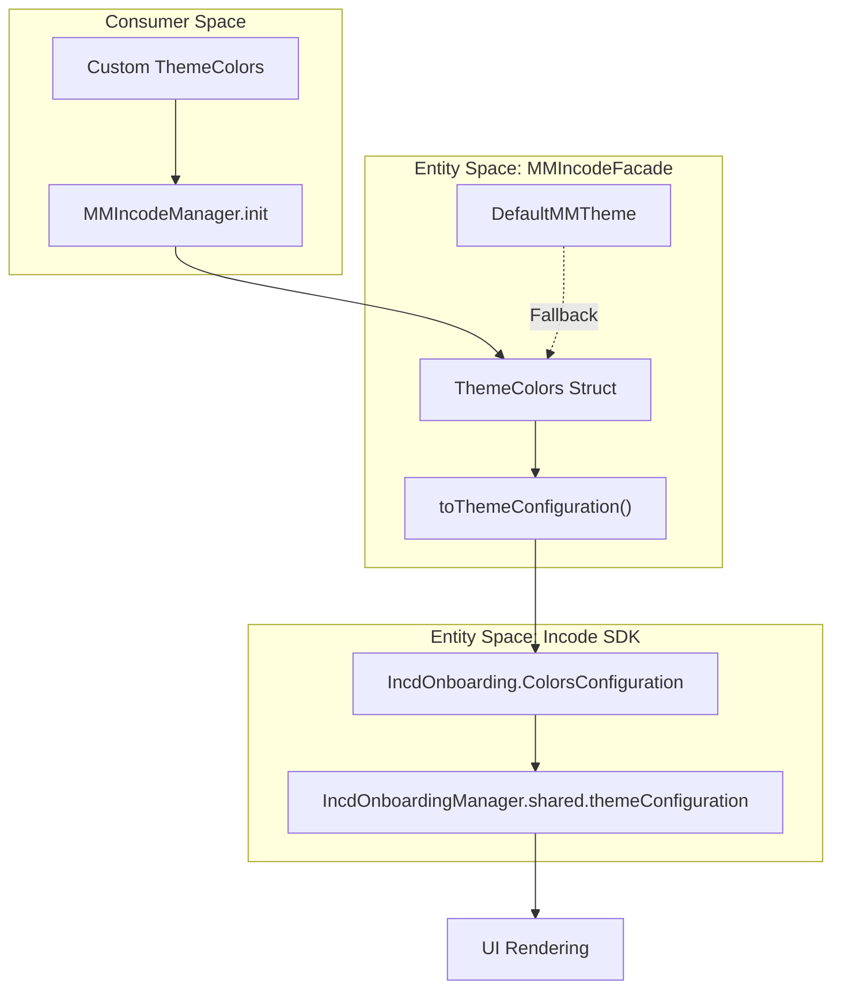

# Theming System

# Theming System

<details>
<summary>Relevant source files</summary>

The following files were used as context for generating this wiki page:

- [README.md](README.md)
- [Sources/Frameworks/IncdOnboarding.xcframework/ios-arm64/IncdOnboarding.framework/Assets.car](Sources/Frameworks/IncdOnboarding.xcframework/ios-arm64/IncdOnboarding.framework/Assets.car)

</details>


The **Theming System** in `MMIncodeFacade` provides a structured way to customize the visual appearance of the Incode SDK's onboarding modules. It abstracts the complex `IncdOnboarding.ColorsConfiguration` into a simplified `ThemeColors` structure, allowing developers to maintain brand consistency with minimal effort.

## Overview

The facade uses a configuration-driven approach to styling. Instead of interacting directly with the underlying SDK's numerous color properties, the facade exposes a high-level `ThemeColors` struct. This struct is then mapped to the SDK's internal configuration via a transformation function.

### Key Components

| Entity | Role |
| :--- | :--- |
| `ThemeColors` | A public struct containing the primary, secondary, and accent colors for the UI. |
| `DefaultMMTheme` | A static utility providing a pre-configured `ThemeColors` instance and SDK-wide font/button settings. |
| `toThemeConfiguration()` | An internal mapping function that converts `ThemeColors` into `IncdOnboarding.ColorsConfiguration`. |

---

## Data Flow: From Facade to SDK

The following diagram illustrates how custom theme definitions flow from the consumer application through the facade and into the Incode SDK's rendering engine.

**Theme Configuration Data Flow**



**Sources:**
- [Sources/MMIncodeFacade/MMIncodeManager.swift:15-30]()
- [Sources/MMIncodeFacade/Models/ThemeColors.swift:9-25]()

---

## Implementation Details

### ThemeColors Struct
The `ThemeColors` struct is the primary interface for visual customization. It utilizes SwiftUI `Color` types for ease of use in modern iOS development.

[Sources/MMIncodeFacade/Models/ThemeColors.swift:9-25]()

```swift
public struct ThemeColors {
    public let primaryColor: Color
    public let secondaryColor: Color
    public let accentColor: Color
    public let backgroundColor: Color
    public let textColor: Color
    // ...
}
```

### Default Configuration
The `DefaultMMTheme` provides the standard "look and feel" for the facade. It also configures the global `IncdOnboardingManager` properties for fonts and button styles.

[Sources/MMIncodeFacade/Models/ThemeColors.swift:45-65]()

```swift
public struct DefaultMMTheme {
    public static let colors = ThemeColors(
        primaryColor: Color(hex: "000000"),
        secondaryColor: Color(hex: "FFFFFF"),
        // ...
    )

    public static func setup() {
        // Sets global SDK font and button corner radius
        IncdOnboardingManager.shared.fontName = "CircularXX-Book"
        IncdOnboardingManager.shared.buttonCornerRadius = 8.0
    }
}
```

### Mapping to Incode SDK
The facade performs a mapping from `ThemeColors` to `IncdOnboarding.ColorsConfiguration`. This involves converting SwiftUI `Color` objects to `UIColor` using a utility extension.

[Sources/MMIncodeFacade/Models/ThemeColors.swift:27-43]()

| Facade Property | SDK Property (ColorsConfiguration) |
| :--- | :--- |
| `primaryColor` | `primaryColor` |
| `secondaryColor` | `secondaryColor` |
| `backgroundColor` | `backgroundColor` |
| `textColor` | `titleLabelColor` & `instructionLabelColor` |

**Sources:**
- [Sources/MMIncodeFacade/Models/ThemeColors.swift:27-43]()
- [Sources/MMIncodeFacade/Shared/Extensions/Color+Extension.swift:5-15]()

---

## Applying Custom Themes

To apply a custom theme, pass a `ThemeColors` instance during the initialization of the `MMIncodeManager`. If no theme is provided, the facade defaults to `DefaultMMTheme.colors`.

### System Association Diagram

This diagram bridges the natural language concepts of "Theming" to the specific code entities involved in the initialization process.

```mermaid
classDiagram
    class "Consumer App" {
        +init(theme: ThemeColors)
    }

    class MMIncodeManager {
        +theme: ThemeColors
        -setupIncode(params: IncodeParams)
    }

    class ThemeColors {
        +primaryColor: Color
        +secondaryColor: Color
        +toThemeConfiguration() IncdOnboarding.ColorsConfiguration
    }

    class IncdOnboardingManager {
        <<Singleton>>
        +themeConfiguration: ColorsConfiguration
    }

    "Consumer App" ..> MMIncodeManager : "Initializes with"
    MMIncodeManager --> ThemeColors : "Holds"
    ThemeColors ..> IncdOnboardingManager : "Applies config to"
```

### Usage Example

[Sources/MMIncodeFacade/MMIncodeManager.swift:15-25]()

```swift
let customColors = ThemeColors(
    primaryColor: .blue,
    secondaryColor: .white,
    accentColor: .orange,
    backgroundColor: .gray,
    textColor: .black
)

let manager = MMIncodeManager(
    params: IncodeParams(urlString: "...", apiKey: "..."),
    theme: customColors // Passing custom colors here
)
```

**Sources:**
- [Sources/MMIncodeFacade/MMIncodeManager.swift:15-30]()
- [README.md:26-30]()

---