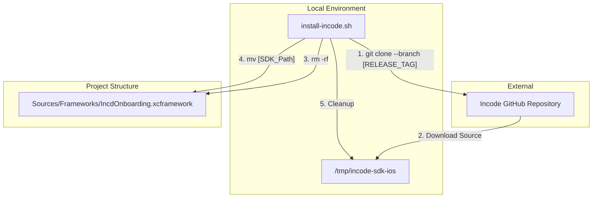
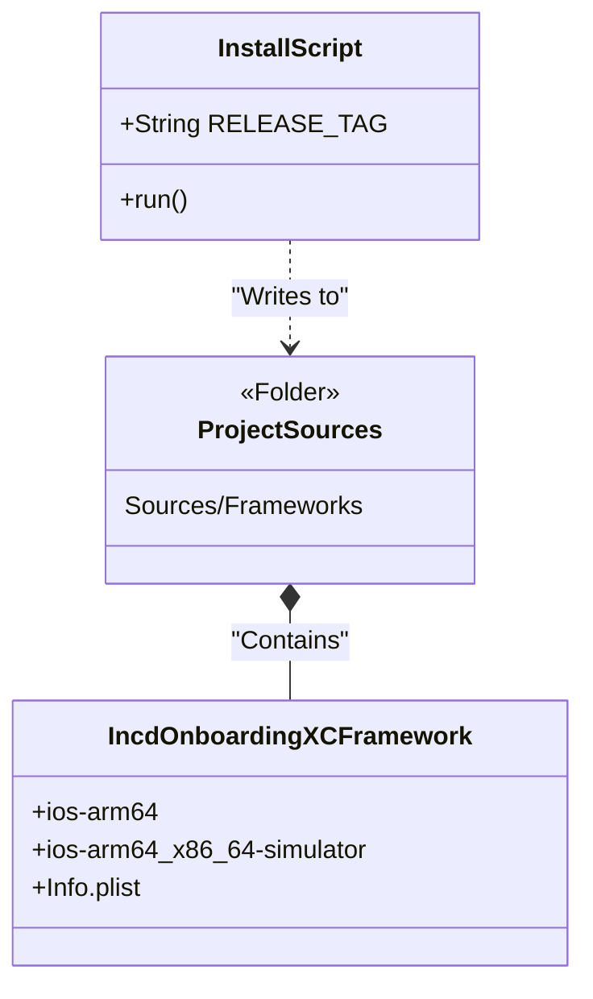

# Updating the Incode SDK

# Updating the Incode SDK

<details>
<summary>Relevant source files</summary>

The following files were used as context for generating this wiki page:

- [README.md](README.md)
- [Sources/Frameworks/IncdOnboarding.xcframework/Info.plist](Sources/Frameworks/IncdOnboarding.xcframework/Info.plist)

</details>


This page provides technical instructions for updating the underlying **IncdOnboarding.xcframework** binary within the `MMIncodeFacade` repository. Because the Incode SDK is distributed as a pre-compiled binary, the repository includes a specialized automation script to handle the download, extraction, and replacement of the framework files.

## Overview of the Update Process

The update process is managed by a shell script located in the `install-frameworks/` directory. This script automates the retrieval of a specific version of the Incode SDK from the official Incode repository and integrates it into the `Sources/Frameworks/` directory of this project.

### Data Flow: SDK Update Lifecycle

The following diagram illustrates how the `install-incode.sh` script interacts with external sources and the internal repository structure.

**Diagram: SDK Installation Workflow**


Sources: [README.md:121-128](), [Sources/Frameworks/IncdOnboarding.xcframework/Info.plist:1-40]()

## Step-by-Step Instructions

To update the SDK, follow these steps from your terminal:

1.  **Navigate to the installation directory**:
    The automation script must be executed from within its containing folder.
    ```console
    cd install-frameworks
    ```

2.  **Execute the install script**:
    Run the script using `sh` and provide the desired `RELEASE_TAG` (e.g., `5.16.0-d`).
    ```console
    sh install-incode.sh 5.16.0-d
    ```

3.  **Verify the Filesystem**:
    Ensure that the directory `Sources/Frameworks/IncdOnboarding.xcframework` has been refreshed. The `Info.plist` inside this directory should reflect the supported architectures for both physical devices and simulators.

Sources: [README.md:121-128](), [Sources/Frameworks/IncdOnboarding.xcframework/Info.plist:5-34]()

## Impact on Repository Structure

When the script runs, it performs destructive operations on the existing framework to ensure no stale headers or binary slices remain.

| Target Path | Action | Description |
| :--- | :--- | :--- |
| `Sources/Frameworks/IncdOnboarding.xcframework` | **Removed & Replaced** | The entire XCFramework bundle is deleted and replaced with the version corresponding to the `RELEASE_TAG`. |
| `Sources/Frameworks/IncdOnboarding.xcframework/Info.plist` | **Updated** | This file is critical for SPM to resolve the `ios-arm64` and `ios-arm64_x86_64-simulator` libraries. |

**Diagram: Entity Mapping - Script to Framework**


Sources: [README.md:130-133](), [Sources/Frameworks/IncdOnboarding.xcframework/Info.plist:5-34]()

## Verification and Compatibility

After running the update script, developers must verify the integration to ensure the facade source code remains compatible with the new SDK version.

### 1. Architecture Verification
The `IncdOnboarding.xcframework` must support both device and simulator architectures. Verify the `AvailableLibraries` key in the `Info.plist`:
*   **Simulator**: `ios-arm64_x86_64-simulator` [Sources/Frameworks/IncdOnboarding.xcframework/Info.plist:9-21]()
*   **Device**: `ios-arm64` [Sources/Frameworks/IncdOnboarding.xcframework/Info.plist:23-33]()

### 2. Source Code Compatibility
The `MMIncodeFacade` acts as a wrapper. Major version jumps in the Incode SDK may introduce breaking changes in:
*   `IncdOnboardingManager` initialization.
*   `IncdOnboardingDelegate` protocol methods.
*   Theme configuration structures (e.g., `ColorsConfiguration`).

If the project fails to compile after an update, check the `IncdOnboarding-Swift.h` header (generated by the SDK) to identify signature changes in the underlying framework.

### 3. Test Mode Check
Ensure that `testMode` functionality is still operational. In `MMIncodeManager`, the `testMode` flag is passed to the SDK to allow simulator testing without a physical camera.
```swift
let manager = MMIncodeManager(INCodeParams(
  urlString: "...",
  apiKey: "...",
  testMode: true // Must be verified after SDK update
))
```

Sources: [README.md:26-30](), [Sources/Frameworks/IncdOnboarding.xcframework/Info.plist:5-34]()

---