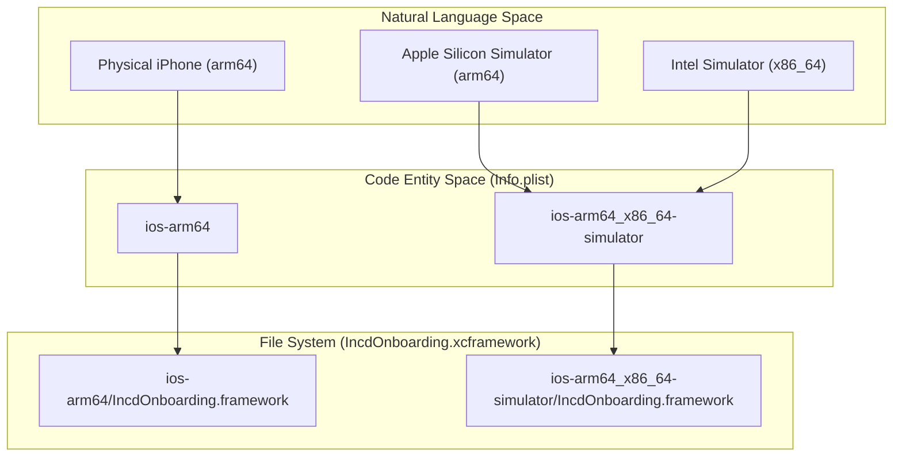
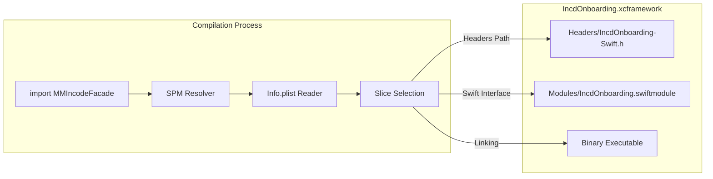

# XCFramework Structure & Architecture

# XCFramework Structure & Architecture

Relevant source files

The following files were used as context for generating this wiki page:

- [Sources/Frameworks/IncdOnboarding.xcframework/Info.plist](Sources/Frameworks/IncdOnboarding.xcframework/Info.plist)
- [Sources/Frameworks/IncdOnboarding.xcframework/ios-arm64/IncdOnboarding.framework/Headers/IncdOnboarding-Swift.h](Sources/Frameworks/IncdOnboarding.xcframework/ios-arm64/IncdOnboarding.framework/Headers/IncdOnboarding-Swift.h)

This page details the internal composition of the `IncdOnboarding.xcframework`, explaining how it is structured to support multiple architectures and how the Swift Package Manager (SPM) interacts with its internal components to provide a seamless development experience across physical devices and simulators.

## XCFramework Bundle Layout

The `IncdOnboarding.xcframework` is a multi-architecture binary bundle that encapsulates the Incode SDK. Unlike a standard `.framework`, an `.xcframework` allows for the inclusion of multiple variants of the same library, each optimized for a specific platform or CPU architecture.

### Info.plist Routing
The root of the bundle contains an `Info.plist` which acts as a router for the build system. It defines two primary library slices:

1.  **ios-arm64_x86_64-simulator**: Designed for the iOS Simulator. It supports both `arm64` (for Apple Silicon Macs) and `x86_64` (for Intel-based Macs) [Sources/Frameworks/IncdOnboarding.xcframework/Info.plist:9-16]().
2.  **ios-arm64**: Designed for physical iOS devices, supporting the `arm64` architecture [Sources/Frameworks/IncdOnboarding.xcframework/Info.plist:23-30]().

The `CFBundlePackageType` is explicitly set to `XFWK` to identify it as an XCFramework [Sources/Frameworks/IncdOnboarding.xcframework/Info.plist:35-36]().

### Build-Time Slice Selection
When a consumer app builds using the `MMIncodeFacade` package, SPM parses this `Info.plist`. Based on the destination (e.g., "My iPhone" vs. "iPhone 15 Pro Simulator"), the compiler selects the corresponding `LibraryPath` (which is `IncdOnboarding.framework` inside the respective subdirectory) [Sources/Frameworks/IncdOnboarding.xcframework/Info.plist:10-11, 25-26]().

### Natural Language to Code Entity Mapping: Bundle Routing
The following diagram maps the high-level build targets to the specific directory structures defined in the `Info.plist`.

**Title: Build Target to Library Slice Mapping**

Sources: [Sources/Frameworks/IncdOnboarding.xcframework/Info.plist:5-34]()

---

## Headers & Objective-C Interoperability

Each slice contains a `Headers/` directory. A critical file within this directory is `IncdOnboarding-Swift.h`. This file is generated by the Swift compiler and allows the Swift-based SDK to be consumed by Objective-C code, or to define the interfaces that the Swift compiler uses to bridge types.

### IncdOnboarding-Swift.h
This header includes standard Swift-to-ObjC bridging macros and imports necessary system frameworks like `CoreData` and `Foundation` [Sources/Frameworks/IncdOnboarding.xcframework/ios-arm64/IncdOnboarding.framework/Headers/IncdOnboarding-Swift.h:25, 191]().

Key characteristics of this header:
*   **Compiler Versioning**: It is generated for specific Swift versions (e.g., Swift 5.5) [Sources/Frameworks/IncdOnboarding.xcframework/ios-arm64/IncdOnboarding.framework/Headers/IncdOnboarding-Swift.h:1]().
*   **Macro Definitions**: It defines macros like `SWIFT_CLASS` and `SWIFT_PROTOCOL` to ensure that classes and protocols are correctly exposed to the Objective-C runtime [Sources/Frameworks/IncdOnboarding.xcframework/ios-arm64/IncdOnboarding.framework/Headers/IncdOnboarding-Swift.h:111-133]().
*   **Availability Guards**: It uses `__has_attribute` and `__has_feature` to ensure compatibility across different versions of the Clang compiler [Sources/Frameworks/IncdOnboarding.xcframework/ios-arm64/IncdOnboarding.framework/Headers/IncdOnboarding-Swift.h:10-15]().

Sources: [Sources/Frameworks/IncdOnboarding.xcframework/ios-arm64/IncdOnboarding.framework/Headers/IncdOnboarding-Swift.h:1-198]()

---

## Modules & Swift Interface

Inside each `.framework` slice is a `Modules/` directory containing the `IncdOnboarding.swiftmodule`. This directory is vital for Swift compilation as it contains the serialized representation of the SDK's public API.

### Swift Module Components
The `Modules/` directory typically contains:
*   **swiftmodule**: The binary format of the public interface.
*   **swiftdoc**: Documentation for the public symbols, enabling IDE autocompletion and Quick Help.
*   **swiftinterface**: A text-based representation of the public API, ensuring module stability across different compiler versions.

### Logical Architecture Data Flow
The following diagram illustrates how the compiler resolves the Incode SDK when `MMIncodeFacade` is imported.

**Title: SDK Resolution and Compilation Flow**

Sources: [Sources/Frameworks/IncdOnboarding.xcframework/Info.plist:5-34](), [Sources/Frameworks/IncdOnboarding.xcframework/ios-arm64/IncdOnboarding.framework/Headers/IncdOnboarding-Swift.h:1-50]()

---

## Summary of Structure

| Component | Path (Relative to .xcframework) | Purpose |
| :--- | :--- | :--- |
| **Routing Manifest** | `Info.plist` | Directs the build system to the correct architecture slice. |
| **Device Slice** | `ios-arm64/` | Contains the binary and headers for physical iOS hardware. |
| **Simulator Slice** | `ios-arm64_x86_64-simulator/` | Contains the binary and headers for Intel/Apple Silicon simulators. |
| **Obj-C Bridging** | `.../Headers/IncdOnboarding-Swift.h` | Exposes Swift APIs to Objective-C and defines runtime compatibility. |
| **Swift Interface** | `.../Modules/IncdOnboarding.swiftmodule/` | Contains serialized public APIs for the Swift compiler. |

Sources: [Sources/Frameworks/IncdOnboarding.xcframework/Info.plist:1-40](), [Sources/Frameworks/IncdOnboarding.xcframework/ios-arm64/IncdOnboarding.framework/Headers/IncdOnboarding-Swift.h:1-198]()

---